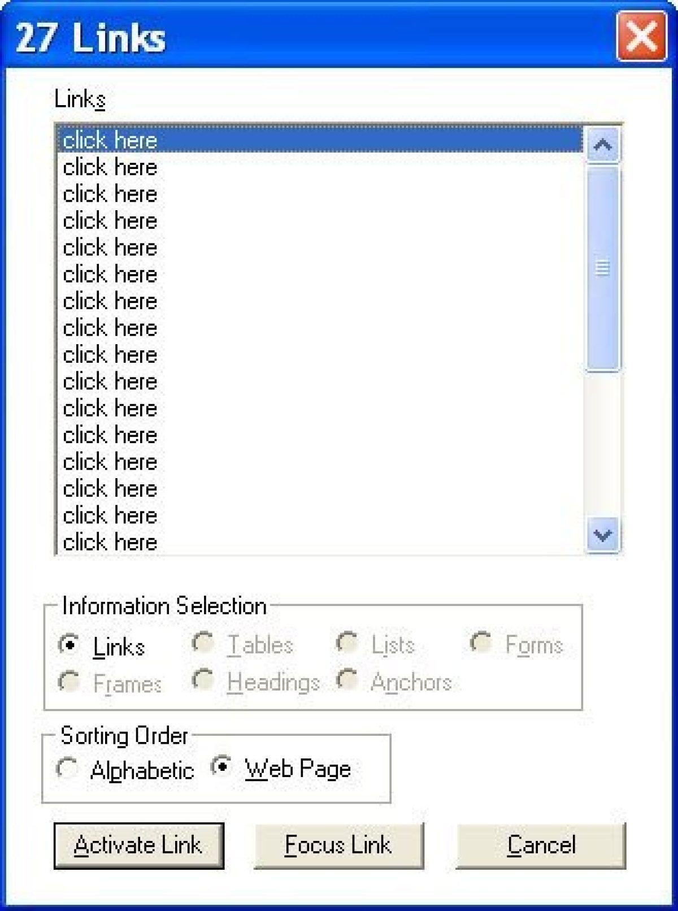
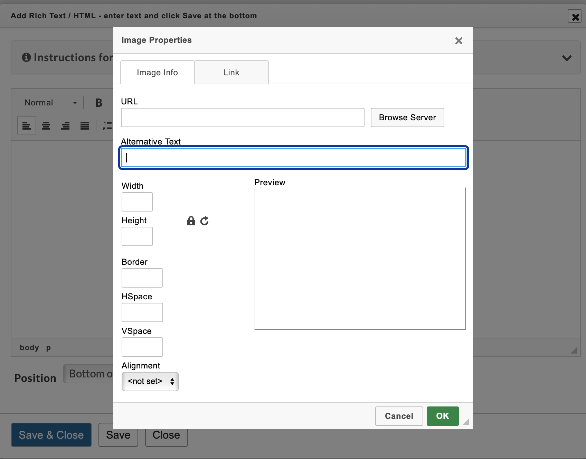
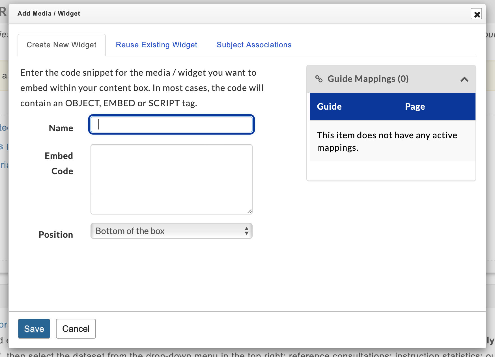
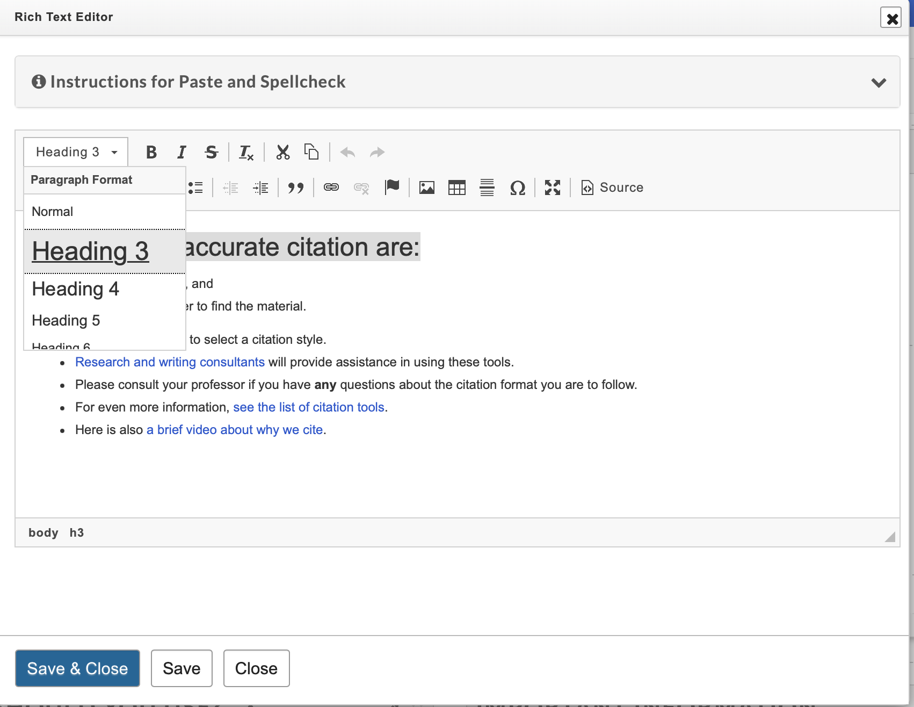
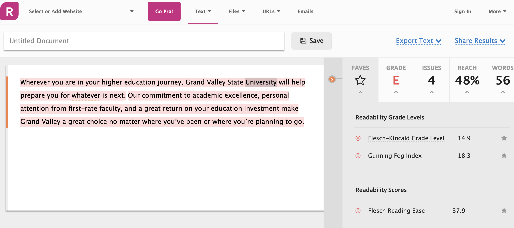
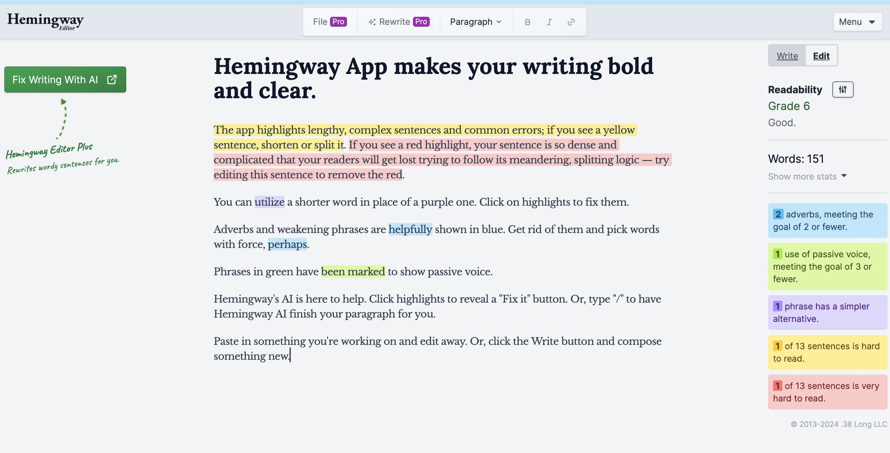
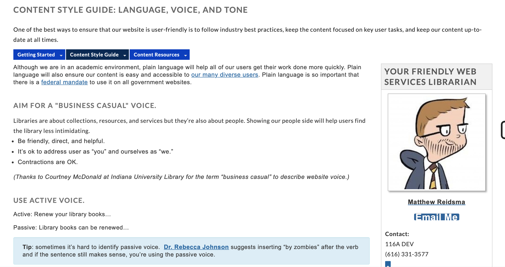
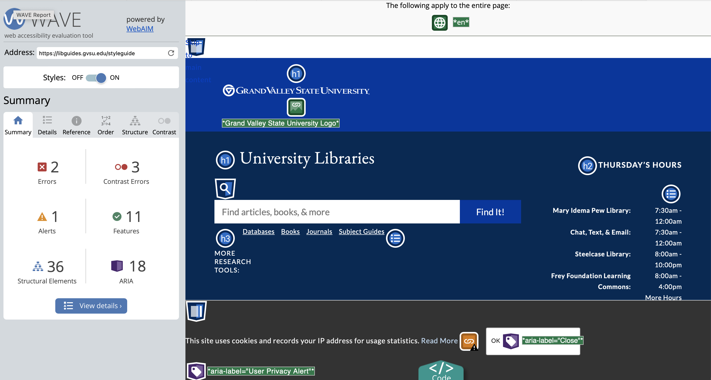
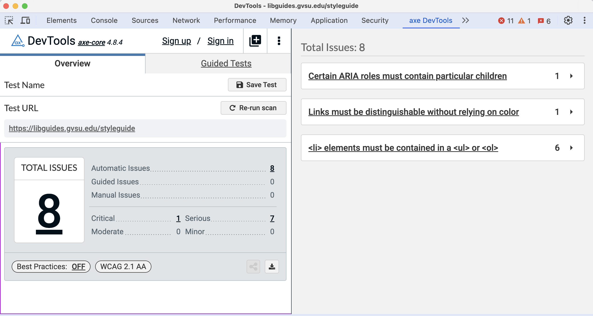
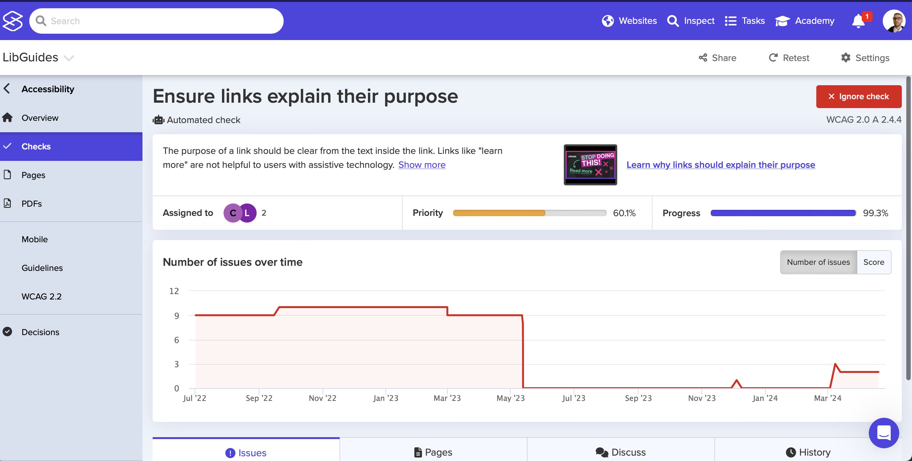

# Accessibility for LibGuides

Matthew Reidsma, April 19, 2024

-----

<h1>What is Accessibility?</h1>

-----

### Accessibility means making your content usable to anyone regardless of their abilities.

#### GVSU Accessibility Site

[https://www.gvsu.edu/accessibility/](https://www.gvsu.edu/accessibility/)

-----

<h1>Why Accessibility?</h1>

-----

<h1>Why Accessibility?</h1>

<ul>
	<li>It's the <em>ethical</em> thing to do (IDEA)</li>
</ul>

-----

<h1>Why Accessibility?</h1>

<ul>
	<li class="blue">It's the <em>ethical</em> thing to do (IDEA)</li>
	<li>Better for <em>all</em> human users</li>
</ul>

-----

<h1>Why Accessibility?</h1>

<ul>
	<li class="blue">It's the <em>ethical</em> thing to do (IDEA)</li>
	<li class="blue">Better for <em>all</em> human users</li>
	<li>Better for <em>non-human</em> users</li>
</ul>

-----

<h1>Why Accessibility?</h1>

<ul>
	<li class="blue">It's the <em>ethical</em> thing to do (IDEA)</li>
	<li class="blue">Better for <em>all</em> human users</li>
	<li class="blue">Better for <em>non-human</em> users</li>
	<li>It's the <em>law!</em></li>
</ul>

-----

<h1>What is  an Assistive Device?</h1>

-----

<iframe src="https://player.vimeo.com/video/1157346?h=b580392e0d" width="640" height="480" frameborder="0" allow="autoplay; fullscreen; picture-in-picture" allowfullscreen></iframe>

<a href="https://vimeo.com/1157346">Aaron Cannon, Blind Web Developer</a> from <a href="https://vimeo.com/cameronmoll">Cameron Moll</a> on <a href="https://vimeo.com">Vimeo</a>.

-----

<h1>Accessible  vs.  non-accessible  content</h1>

-----

-----

### ...

-----

<iframe width="560" height="315" src="https://www.youtube.com/embed/Un6eK13q4rI?si=VEM-bmJYcNDFaC8L" title="YouTube video player" frameborder="0" allow="accelerometer; autoplay; clipboard-write; encrypted-media; gyroscope; picture-in-picture; web-share" referrerpolicy="strict-origin-when-cross-origin" allowfullscreen></iframe>

-----

<iframe width="315" height="560" src="https://www.youtube.com/embed/Z1jTV3bhDL4" title="YouTube video player" frameborder="0" allow="accelerometer; autoplay; clipboard-write; encrypted-media; gyroscope; picture-in-picture; web-share"allowfullscreen></iframe>

-----

<h1>Click Here</h1>

-----

-----

### Write links that clearly describe their purpose or content.

#### 4 Syllables

[Link purpose for web writers](https://4syllables.com.au/articles/accessibility-writers-links)

-----

<h1>A Word on Headings</h1>

-----

<pre><code>
	&lt;h1&gt;Main Heading&lt;/h1&gt;
	&lt;h2&gt;Sub-Heading&lt;/h1&gt;
	&lt;h3&gt;Sub-Sub-Heading&lt;/h1&gt;
	&lt;p&gt;&lt;strong&gt;Pretending to be a Heading&lt;/strong&gt;&lt;/p&gt;
</code></pre>

[Headings and labels - accessibility for web writers](https://4syllables.com.au/articles/accessibility-writers-labels)

-----

### HTML is a <em class="blue">Semantic Language</em>

-----

### Presentation vs. Structure

-----

<h1>Making Accessibile Content</h1>

-----

<h1>Making Accessibile Content</h1>

<ol>
	<li>Text Alternatives</li>
</ol>

-----

### The same image may require a different text alternative when it plays a different role or is used in a different context.

#### 4 Syllables

[Text Alternatives - Some Examples](https://4syllables.com.au/articles/text-alternatives-images-examples/)

-----

-----

### All video material ... on university web pages or otherwise available to the general public require captions. 

#### GVSU eLearning Policy

[Accessibility - Captioned Media Guidelines](https://www.gvsu.edu/elearn/accessibility-captioned-media-guidelines-82.htm)

-----

-----

<h1>Making Accessibile Content</h1>

<ol>
	<li class="blue">Text Alternatives</li>
	<li>Headings and Lists</li>
</ol>

-----

-----

<h1>Making Accessibile Content</h1>

<ol>
	<li class="blue">Text Alternatives</li>
	<li class="blue">Headings and Lists</li>
	<li>Descriptive Link Text</li>
</ol>

-----

### Choose link text that concisely indicates the nature of the linked document. 

#### A List Apart

[A List Apart - Style Guide](https://alistapart.com/about/style-guide/#linking)

-----

<h1>Making Accessibile Content</h1>

<ol>
	<li class="blue">Text Alternatives</li>
	<li class="blue">Headings and Lists</li>
	<li class="blue">Descriptive Link Text</li>
	<li>Readability</li>
</ol>

-----

[Readable's Text Scoring Tool](https://app.readable.com/text/)

-----

[Hemingway editor](https://hemingwayapp.com)

-----

[GVSU UL Style Guide Voice and Tone]()

-----

<h1>Making Accessibile Content</h1>

<ol>
	<li class="blue">Text Alternatives</li>
	<li class="blue">Headings and Lists</li>
	<li class="blue">Descriptive Link Text</li>
	<li class="blue">Readability</li>
	<li>Don't Use Documents! (PDFs/Word)</li>
</ol>

-----

### When adding a PDF to your site, you are making it more challenging for a user to access, understand, and share your content. 

#### GVSU Web Team

[PDF Documents - GVSU Web Team](https://www.gvsu.edu/accessibility/pdf-documents-13.htm)

-----

<h1>Oops I made  Inaccessible  Content</h1>

-----

<h1>Tools</h1>

<ol>
	<li>WAVE WebAIM Plugin</li>
</ol>

[Web Accessibility Evaluation Tool](https://wave.webaim.org)

-----

-----

<h1>Tools</h1>

<ol>
	<li class="blue">WAVE WebAIM Plugin</li>
	<li>Deque aXe</li>
</ol>

[Web Accessibility Evaluation Tool](https://wave.webaim.org)

-----

-----

<h1>Tools</h1>

<ol>
	<li class="blue">WAVE WebAIM Plugin</li>
	<li class="blue">Deque aXe</li>
	<li>Silktide*</li>
</ol>

[Silktide](https://silktide.com)

-----

-----

<h1>Tools</h1>

<ol>
	<li class="blue">WAVE WebAIM Plugin</li>
	<li class="blue">Deque aXe
	</li>
	<li class="blue">Silktide*</li>
	<li>Grammarly</li>
</ol>

[Grammarly](https://www.grammarly.com/browser/chrome)

-----

<h1>Manual checks</h1>

<ol>
	<li>Alternative Text</li>
</ol>

-----

<h1>Manual checks</h1>

<ol>
	<li class="blue">Alternative Text</li>
	<li>Review Link Text</li>
</ol>

-----

* [UL Style Guide:](https://gvsu.edu/library/styleguide)
* [LibGuides Best Practices](https://libguides.gvsu.edu/libguideshelp)
* [4 Syllables Accessibility Articles](https://4syllables.com.au/articles/category/accessibility)
* [GVSU Web Accessibility Site](https://www.gvsu.edu/accessibility/)

-----

# ThankYou 

