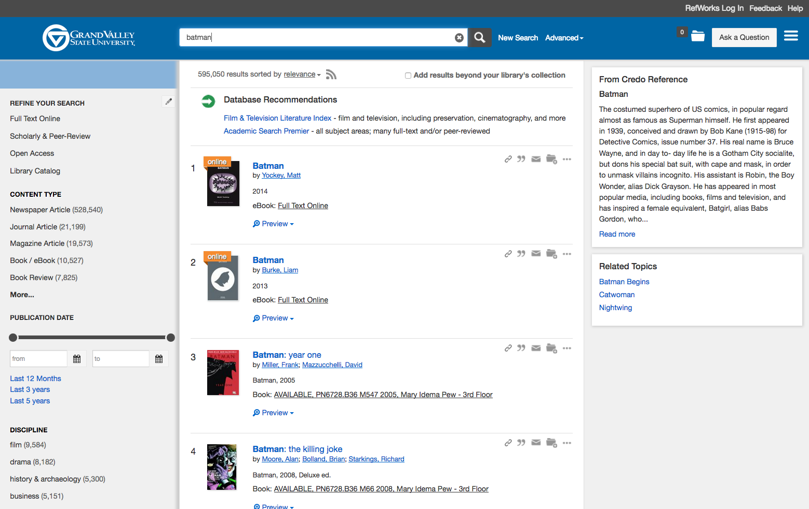
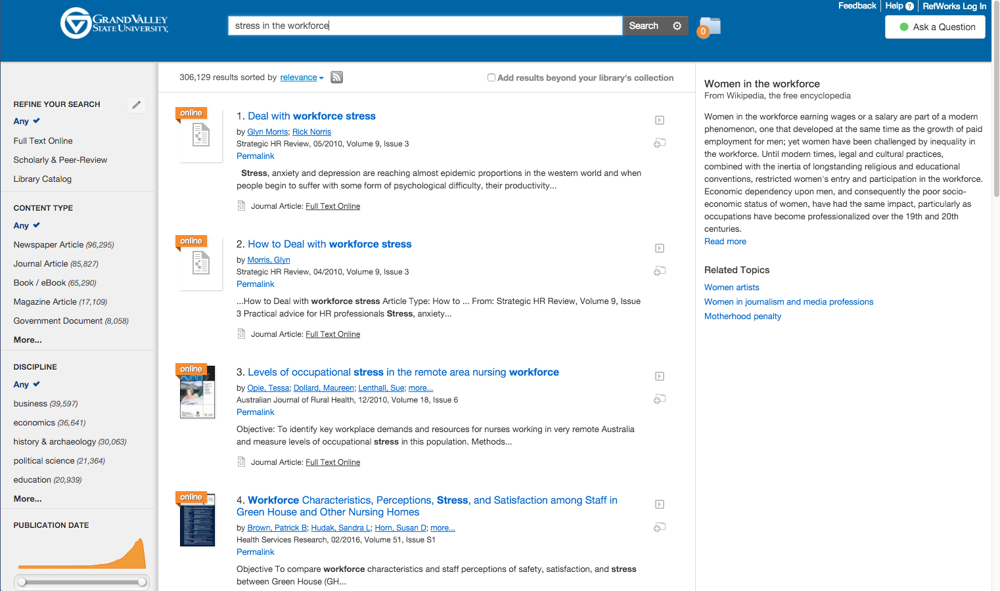
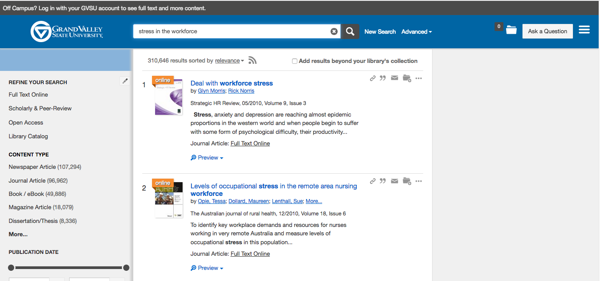
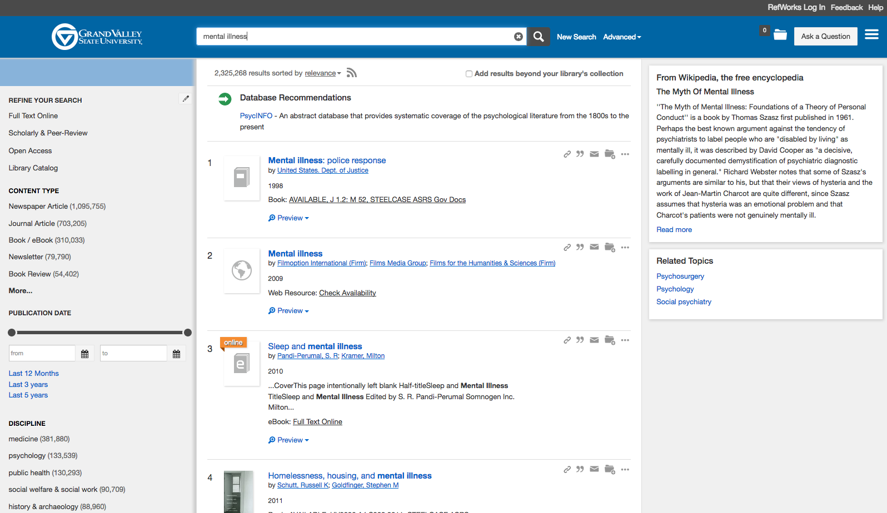
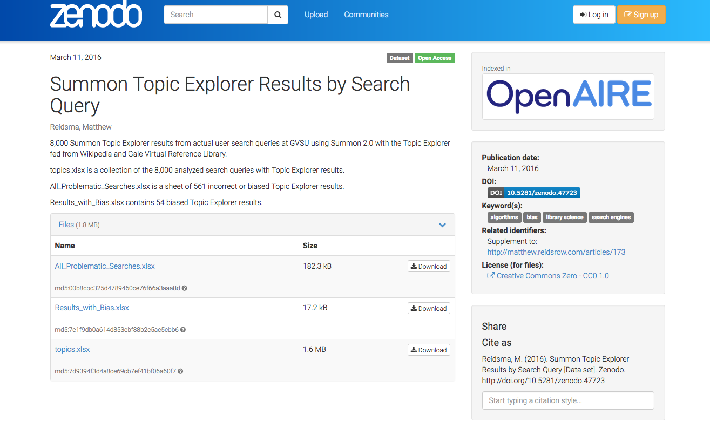
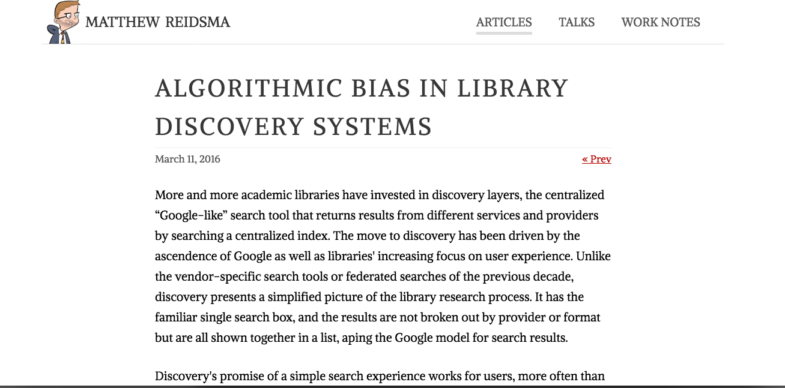
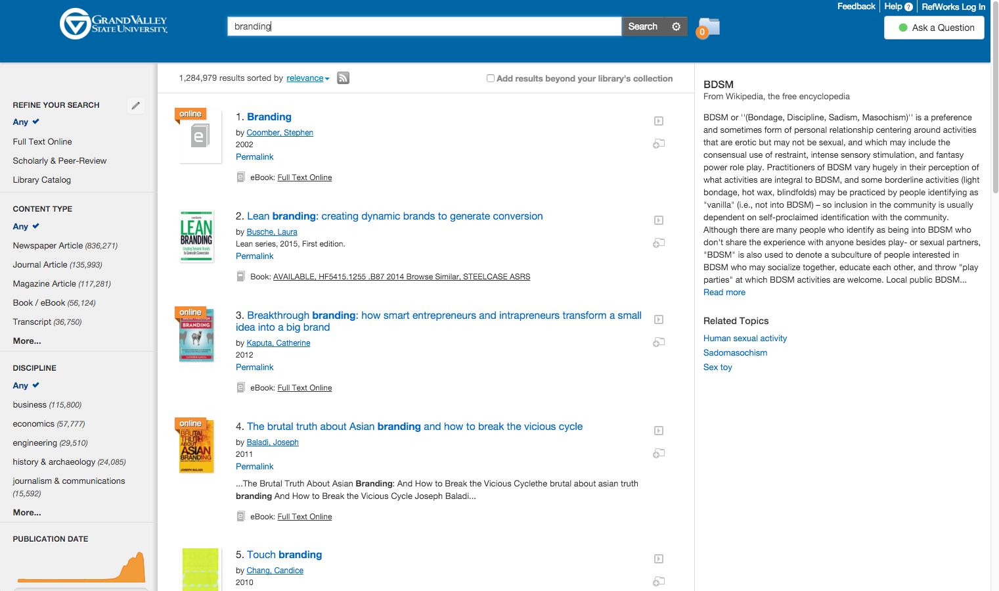
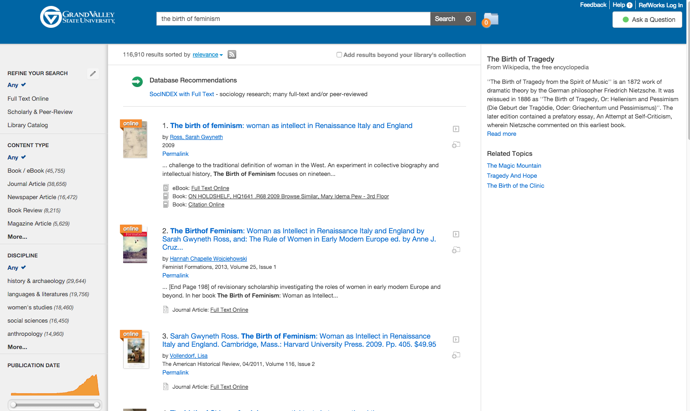
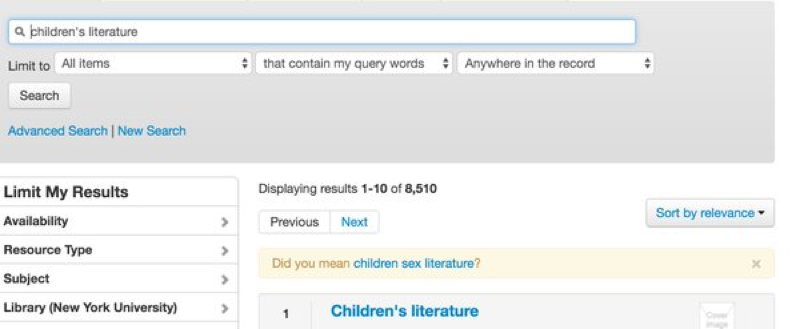

# Auditing Algorithms

Matthew Reidsma // Grand Valley State University

-----

Summon search results for "Batman" at Grand Valley State University

Note: 
Many library folks have a go-to search they use to try out different search tools. By using the same terms in many tools over a period of time, you can get a good sense of how a search tool's algorithms perform in comparison to other tools you've tried. I use "batman," because it's short, and the search results will be a mix of popular and scholarly sources, a variety of formats, and items from the 16th and 17th centuries. This itself is a crude but simple way to evaluate algorithms, but it id ruled more by gut and memory than analysis.  

-----

Summon search results for "Stress in the workplace" at Grand Valley State University, Fall 2015

Note:
In 2015 my colleague Jeffrey Daniels showed me the Summon search results for his go-to search: "Stress in the workplace." Jeff likes this search because 'stress' is a common engineering term as well as one common to psychology and the social sciences. The search demonstrates how well a system handles word proximities, and in this regard, Summon did well. There are no apparent results for evaluating bridge design. But Summon's Topic Explorer, the right-hand sidebar that provides contextual information about the topic you are searching for, had an issue. It suggested that Jeff's search for "stress in the workplace" was really a search about women in the workforce. Implying that stress at work was caused, perhaps, by women.

-----

Summon search results for "Stress in the workplace" at Grand Valley State University, Winter 2018

Note:
I shared it with the Summon team, and within a day they blocked the result.

-----

Summon search results for "mental illness" at Grand Valley State University, February 2018, 3 years after the issue was reported

Note: 
I started looking closer at the Topic Explorer, eventually combing through 8,000 searches that returned a Topic Explorer result and found a number of other problems, mostly in searches related to women, the LGBTQ community, African Americans, Muslims, and mental illness. I shared my results with the Summon team, and they "blocked" many of the problematic results, although not this one, or any search related to mental illness, which still suggests it is a "myth."

-----

<!-- .slide: data-background-image="img/goodman.jpg" -->

### Technology is a branch of moral philosophy, not of science.

#### Paul Goodman

[Goodman, P. (1969). Can Technology Be Humane? *New York Review of Books*, Nov. 20, 1969](http://www.nybooks.com/articles/1969/11/20/can-technology-be-humane) // Photo: Dust Jacket of *Growing Up Absurd*

Note:
It's important to note that they did not adjust the Topic Explorer algorithm. Instead, they hid  "problematic" results. In my conversations, I came to realize that they saw this as a technical problem, not a social or moral one. 

It reminded me of Paul Goodman's quip in the late 1960s about how technology is primarily an ethical undertaking. Goodman's point was that all our decisions about how people live and work and act in the world are fundamentally moral issues. But the growing body of research on critical algorithmic studies confirms that most if not all companies that produce algorithmic systems see them (or at least publicly claim to see them) as neutral, objective technical achievements. The footer of Google News, for instance, reminds us that the stories were "selected by an algorithm," and not by people, as if that absolves the company of any editorial issues.

If we see biased results as a technical problem, an acceptable solution may be to hide the offending results. But solutions that make sense for technical issues will often be different from solutions that make sense for ethical issues. 

-----

<!-- .slide: data-background-image="img/orphanides.jpg" -->

### System design reflects the designer's values and the cultural context.

#### Andreas Orphanides

[Architecture is politics: The power and the perils of systems design](https://docs.google.com/presentation/d/180dMBG26xMYB9gfIotoUyCBQfO3XfmHiJGQjvn58GwY/edit?pref=2&pli=1#slide=id.gf03c9bb35_0_143) // Photo: [NC State Libraries](http://www.lib.ncsu.edu/staff/akorphan)

Note:

Some of our esteemed colleagues in this very room have pushed back against the idea that these systems are objective, neutral and exclusively technical. When I began researching library discovery algorithms, I began by reading a lot of critical studies of algorithms, which mostly focus on public, commercial systems that use algorithms: Google, Facebook, Twitter, policing and legal software. Very important work is bring done by an incredible community of journalists and scholars like Julia Angwin at Propublica, Zeynep Tufekci at the University of North Carolina, and Safiya Noble at the Annenberg School of Communication, whose new book *Algorithms of Oppression* comes out next week. (You should buy it, and get your library to buy it, too.) 

While a lot of academics focus on algorithms outside the academy, I was interested in the algorithms within Higher Ed that condition the learning environment.

-----

<h1>The Algorithm</h1>

cf. Kitchin, R. (2017). Thinking critically about and researching algorithms. *Information, Communication & Society, 20*(1), 14-29, DOI: 10.1080/1369118X.2016.1154087

Note:
A basic definition of an algorithm is a set of steps used to process an input to produce an output (cf. Kitchin, 2017, p.14). So, to begin to audit an algorithm, we might want to know the steps the algorithm walks through, either in code or in pseudo-code. What decisions are being made? But here's the catch: all of the commercial discovery tools consider their search algorithms to be major intellectual property assets. They won't reveal the code or even pseudo-code to us.

Of course, algorithms are hardly straightforward and linear, and it's unlikely we would be able to make heads or tails out of the code if we had access to it. And the steps built out of code are only part of the story: the index has to be considered, too. What the algorithm looks for only makes sense if you understand what it looks at. We don't even know the exact parameters of what is in the discovery service's index (although there is more clarity here, since the index is what shows up as visible outputs.)

-----

<h3 style="text-align:center;">The Algorithm</h3>

1. Review Code or psuedo-code
2. Look at the settings
3. Read the documentation
4. Mailing lists
5. Release announcements
6. Review known indexed content

Note:  
So, we look for hints, or proxies for the algorithm. I started by looking through Summon's administrative settings. Any setting that allowed me to change how results appear or are ranked gave a hint to something the algorithm values. The Summon documentation was also helpful. Articles explained what fields were searched, how records were de-duplicated, how the algorithm determines "relevance" (in very general terms), and how to conduct advanced search techniques such as keyword weighting and proximity searches. Taken together, these helped me better understand how the algorithm and the index work together. I also read through mailing list posts from the project managers, specifically around changes to or the functioning of the algorithm, and read the release announcements carefully. 

-----

<h1>Inputs &amp; Outputs</h1>

Note:
But looking at code or understanding the boundaries of the index will only get you so far, and risks fetishizing the algorithm. Algorithms exist to do something, to create outputs from inputs. We need to see them work.

So, while the inner workings are still hidden, we can see what kinds of outputs we get by changing inputs.

But typing in searches one at a time doesn't scale.

-----

<pre><code>
var t = $('[aria-label="Topic Summary"]');

if($(t).length > 0) {

      var topicTitle = $(t).find('h4:first').text();
      var topicFrom = $(t).find('div.from').text();
      var topicSummary = $(t).find('div.snippet').text();

     $.ajax({
        url: "https://REMOTE/SCRIPT/index.php",
        method: "POST",
        data: { search : searchQuery, 
        	    topic: topicTitle,
        	    from: topicFrom,
        	    summary: topicSummary  }
});
</code></pre>

[https://github.com/gvsulib/Summon-2.0-Scripts/blob/develop/summon2.0.js#L161](https://github.com/gvsulib/Summon-2.0-Scripts/blob/develop/summon2.0.js#L161)

Note:
So I captured the results as our users searched in Summon. This has the benefit of showing actual searches rather than hypothetical searches.

This is a simplified version of the jQuery function I used to capture search queries and Topic Explorer results. Whenever Summon executed a search and a Topic Explorer result was shown, the script would grab the search query and the heading, source, and text of the Topic Explorer result and send a POST request to a PHP script that parsed the data and stored it in a MySQL database. This method works for looking at the results of what other people are searching for, but you need to be cautious about privacy. In this case, searches that bring up Topic Explorer results are very general searches, often 1-2 terms. By not saving any information about who did the search, what other searches they did, or when the search was run, I lowered the possibility of capturing reidentifiable data about our users. 

You could easily convert this to a bookmarklet to run on a page where you define a search, or create a bot or spider to scrape the page and store the results from all manner of algorithms: search results, database recommendations, spelling corrections, query expansions, autosuggestions, related topics, related searches, and more. (There are some legal concerns we'll get to in a moment with these approaches.)

-----

[http://dx.doi.org/10.5281/zenodo.47723](http://dx.doi.org/10.5281/zenodo.47723)

Note:
I matched 8,000 search queries with their respective topic explorer results, and released them as a data set, if you want to look them over or use them in your research. The data set includes very general search terms and the respective Topic Explorer result for each.

8,000 results is a lot of results when you are reviewing them one at a time by yourself. But to understand the workings of a complex algorithm? It's not nearly enough. But it's a start.

-----

[Algorithmic Bias in Library Discovery Systems](https://matthew.reidsrow.com/articles/173) by Matthew Reidsma

Note:
I shared my data set with the Summon team in advance of publishing my results, which looked at the set of 8,000 results and found that the Topic Explorer algorithm was able to at least generally identify a topic about 90% of the time.

-----

Some of the results were incorrect but maybe not wrong.

Note:
About 1% of the results were biased. The remaining 9% were 
incorrect, but maybe not all were wrong, like this search that equated the ubiquitous marketing concept of "branding" with Bondage, Discipline, Sadism, and Masochism. 

-----

Summon results for Women in Film

Note:
But often the incorrect results slipped into bias, reinforcing negative stereotypes, like a search for "women in film" that apparently couldn't imagine anything more relevant than an exploitation genre.

-----

Summon results for the Birth of Feminism

Note:
Or the tendency of the algorithm to latch on to phrasings like a Mad Libs search engine, like this search for the Sarah Gwyneth Ross' book *Birth of Feminism* that returned the *Birth of Tragedy* instead. This is what was behind the "women in the workforce" result my colleague Jeff showed me. You could also search for "heroes in the workforce" and get "women in the workforce." 

-----

Primo suggests that "Waste" is just "Women," misspelled. From [Damn You, Auto Suggest](http://damnyouautosuggest.tumblr.com)

Note:
If you want to examine an algorithm thoroughly, nothing beats collecting a lot of sample results, but there are other places to look for problems. I wish I knew who the mastermind behind this site was, but Damn You, Auto Suggest is a Tumblr with the subtitle of "Primo Knows Best. Auto-suggest failures from library catalogs and databases." You can even submit your own.

Here Primo suggests that a search for "New York Waste" should have been a search for "New York Women."

-----

Primo suggesting Children's Sex Literature as a replacement for Children's Literature. From [@Nadaleen](https://twitter.com/Nadaleen/status/730116596728012800)

Note:
I've also been able to find problematic results from colleagues on Twitter, like this one that Nadaleen Tempelman-Kluit posted from Primo, where it thinks a search for Children's Literature could only be made better by transforming it into a search for Children's Sex Literature.

-----

<h1>Use  &amp; Effect</h1>

Note:
But algorithms aren't just code and inputs and outputs. They are used by people in order to do something else. We need to study those effects, too, and this is where my research is taking me. 

-----

<!-- .slide: data-background-image="img/kitchin.jpg" -->

### Algorithms are not just what programmers create, or the effects they create based on certain input, they are also what users make of them on a daily basis.

#### Rob Kitchin

Kitchin, R. (2017). Thinking critically about and researching algorithms. *Information, Communication & Society, 20*(1), p.18, DOI: 10.1080/1369118X.2016.1154087 // Photo: [Maynooth University](https://www.maynoothuniversity.ie/geography/our-people/rob-kitchin)

Note:
Algorithms show and hide possibilities from users, suggesting what a search might really be about. In addition to asking what an algorithm looks at, and what kinds of results it returns, we need to ask how it affects the users who interact with the algorithm and its results. This is where ethnography and user research can come in. I will be talking to users, and running ethnographic experiments over the next year to better understand the impact that algorithmic outputs - both good and bad - have on learning and research.

-----

A known item search for a book on LGBT youth returns the item and a random book
on mental illness. What made the algorithm suggest this item?

Note:
Here is a result that was shared with me by one of our users. It's a known item search for a book on the information needs of LGBT youth that returns only 2 items: the book and a guide to "mental illness." 

As a researcher, results like these are often the ones that expose the inner workings of the algorithm more clearly. They are like glitches in the Matrix.

But for the user who was searching for this book? What was the impact of seeing these books next to each other? Looking at inputs and outputs alone won't tell us how these results affect our users. Merely returning some relevant results isn't good enough. What we show (and don't show) matters. 

-----

<!-- .slide: data-background-image="img/ananny.jpg" -->

### Reckless associations—made by humans or computers—can do very real harm especially when they appear in supposedly neutral environments.

#### Mike Ananny

[The Curious Connection Between Apps for Gay Men and Sex Offenders](https://www.theatlantic.com/technology/archive/2011/04/the-curious-connection-between-apps-for-gay-men-and-sex-offenders/237340/) // Photo: [mike.annany.com](http://mike.annany.com)

Note:
These are challenging, scary, ethical issues. But library search tools are sold as neutral, objective places for learning and research. That is not the case, and part of the reason for auditing our algorithmic tools is to correct this kind of "objective" marketing,  but also to work with vendors to improve the algorithms.

-----

### The purpose of a system is what it does.

#### Stafford Beer

Beer, S. (2002). “What is Cybernetics?” Kybernetes, 31(2), pp. 209–19.

Note:
A word on the responsibilities of vendors. If your search tool reinforces and reproduces systemic racial, gender, religious, or other biases - it doesn't matter if you "didn't intend" to build a system with those biases. That's what you system does. It is your responsibility to make a system that is fair for all users. Your responsibility doesn't end when we go live with your tool.

-----

From [The Revolution Will Not Be Standardized](https://webcast.gigtv.com.au/Mediasite/Showcase/vala2018/Presentation/31066bb7c4bc483a8647dc496b4c68181d) by Angela Galvan.

Note:
But these search results are also the most visible and used parts of our library websites, and so they speak to our users about our values. Yesterday my fellow *Weave Journal of Library User Experience* editor Angela Galvan gave the keynote at VALA in Melbourne. She noted "Glitches are the unintentional exposure of values." For those of us who study algorithms, problematic results give us a clearer window into what an algorithm values. But our users will read that as what we in the library value. It is our responsibility to ensure that the values we claim to have are what are reflected in our tools. Our responsibility doesn't end when we sign the license agreement.

-----

<h2 style="text-align:center;">Opportunities:</h2>

* Pressures of wealth creation are less direct
* No A/B testing, Machine Learning BS
* Content creators don't "game" the algorithm

Note:
Now I'm going to try to recruit you to study the algorithms in your library systems. These algorithms are not affected by some of the most challenging parts of researching commercial search algorithms. 

For one, the pressures of capital and wealth creation are not as direct as in an advertising-supported search tool like Google. There are (theoretically) no ads in our discovery services. Libraries are the paying customer, not the end user.

-----

<h2 style="text-align:center;">Opportunities:</h2>

* Pressures of wealth creation are less direct
* No A/B testing, Machine Learning BS
* Content creators don't "game" the algorithm

Note:
Because libraries are licensing this software, we expect that the vendor won't experiment with new features in our live discovery systems. And as of this moment, none of the vendors appears to be using machine learning algorithms to personalize search results for our users. (It will get there, but some of them are using tables for layout, so I think we're safe for a bit.) We can be pretty sure that all our users are seeing the same results for the same searches (except for some differences in on-campus and off-campus searches.)

-----

<h2 style="text-align:center;">Opportunities:</h2>

* Pressures of wealth creation are less direct
* No A/B testing, Machine Learning BS
* Content creators don't "game" the algorithm

Note:
And the content these search tools index isn't written to be searched in a search engine like web content. Much of it is written without worrying whether anyone will or can read and make sense of it, let alone a search engine. So when a result appears in a search, we can be reasonably sure it is there because of the algorithm, not manipulation on the part of an Assistant Professor of Botany.

-----

<h2 style="text-align:center;">Challenges:</h2>

* Dependant on local collection practices
* Metadata is a hot mess
* Restrictive <abbr title="End User License Agreements">EULA</abbr>s

Note:
On the other hand, discovery systems have challenges that are not as common in other algorithmic systems. 

The most obvious is that search results from my discovery instance won't be the same for yours, because of the different collection practices of our institutions. This might not affect the "supporting" algorithms that are sprinkled around the main search results, like Topic Explorer or related searches, but it definitely affects the results from your collection.

-----

<h2 style="text-align:center;">Challenges:</h2>

* Dependant on local collection practices
* Metadata is a hot mess
* Restrictive <abbr title="End User License Agreements">EULA</abbr>s

Note:
Trying to understand why something appears in a results set can be challenging, because items in a discovery service's index often blend all the varied metadata practices of hundreds or different database providers into one big, messy soup. Of course, they often have a more structured taxonomy, as well, but results may appear because one of your keywords matched a thesaurus entry for a subject term in an obscure database. This metadata opaqueness can complicate our understanding of how algorithms choose results.

-----

<h2 style="text-align:center;">Challenges:</h2>

* Dependant on local collection practices
* Metadata is a hot mess
* Restrictive <abbr title="End User License Agreements">EULA</abbr>s

Note:
Finally, if you want to study a tool that isn't the one your institution subscribes to, you may be thwarted by the End User License Agreement for the discovery service. Both (EDS) EBSCO discovery service and OCLC's Worldshare prohibit the search interface from being used by "unauthorized users," which is basically everyone but currently affiliated students, staff, faculty, or patrons at the subscribing institution. 

Even if you could use the interfaces, none of us has the time to manually search and record results, so we'd ideally write a script to do this for us. But the license agreement may prohibit this, as well. (The Computer Fraud and Abuse Act is also so broad that even if the EULA didn't prohibit this, you might be in legal trouble from scraping results anyway.) If you subscribe to a service, you may be able to collect the results with a script in the guise of collecting usage data. That's what I did with Summon.

(A quick point of order: I am not a lawyer and this was not legal advice.)

-----

# Join Me? 

<h3 style="text-align:center">[reidsmam@gvsu.edu](mailto:reidsmam@gvsu.edu)</h3>

Note:
So, here's my pitch: help me and all of us better understand our library discovery algorithms. If you're an authorized user, or a representative from EBSCO or OCLC, I'd love to talk with you. The license agreements say I can't use the tools, but they never said anything about me asking another authorized user to collect search results.

Better yet: dive in yourself and examine the algorithms, inputs, and outputs; talk to users, and share what you learn. 

-----

# ThankYou 

Note:
Thank you for listening.

