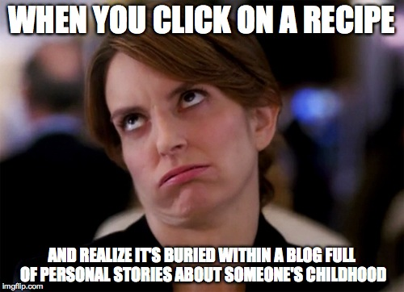
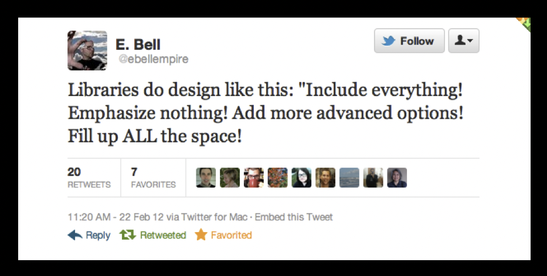

# Content Strategy For LibGuides

Matthew Reidsma

-----

<h1>Library Website</h1>

-----

-----

-----

### The library website is an integrated representation of the library, providing continuously updated content and tools to engage with the academic mission of the university.

#### Courtney McDonald and Heidi Burkhardt 

"Library-Authored Web Content and the Need for Content Strategy", <em>Information Technology and Libraries</em>, September 2019; p.15

-----

### [The library website] is constructed and maintained for the benefit of the user.

#### Courtney McDonald and Heidi Burkhardt 

"Library-Authored Web Content and the Need for Content Strategy", <em>Information Technology and Libraries</em>, September 2019; p.15

-----

<h1>Librarian-authored Content</h1>

-----

<h1><em>Library</em>-authored Content</h1>

-----

### Libraries lack an editorial culture where content production and management is viewed as a collective rather than a personal effort.

#### Suzanne Chapman and Ian Demsky

"Taming the Kudzu: An Academic Library's Experience with Web Content Strategy", <em>Cutting-Edge Research in Developing the Library of the Future</em>, ed. Bradford Lee Eden (Lanham, MD: Rowman & Littlefield, 2015). p.35.

-----

<h1>What is Content Strategy?</h1>

-----

<!-- .slide: data-background-image="img/kissane.jpg" -->

### Good Content is <em>Appropriate</em>

#### Erin Kissane

Kissane, E. (2011). *The ELements of Content Strategy*. New York: A Book Apart. p. 4.

-----

-----

<!-- .slide: data-background-image="img/kissane.jpg" -->

### Good Content is <em>Useful</em>

#### Erin Kissane

Kissane, E. (2011). *The ELements of Content Strategy*. New York: A Book Apart. p. 7.

-----

-----

<!-- .slide: data-background-image="img/kissane.jpg" -->

### Good Content is <em>User-Centered</em>

#### Erin Kissane

Kissane, E. (2011). *The ELements of Content Strategy*. New York: A Book Apart. p. 8.

-----

Erin White, VCU Libraries.

-----

<!-- .slide: data-background-image="img/kissane.jpg" -->

### Good Content is <em>Clear</em>

#### Erin Kissane

Kissane, E. (2011). *The ELements of Content Strategy*. New York: A Book Apart. p. 9.

-----

-----

<!-- .slide: data-background-image="img/kissane.jpg" -->

### Good Content is <em>Consistent</em>

#### Erin Kissane

Kissane, E. (2011). *The ELements of Content Strategy*. New York: A Book Apart. p. 10.

-----

### 1. Assets (Links, Images, Databases, etc.)

-----

-----

### 1. Assets (Links, Images, Databases, etc.)
### 2. Boxes

-----

-----

### 1. Assets (Links, Images, Databases, etc.)
### 2. Boxes
### 3. Pages

-----

-----

### 1. Assets (Links, Images, Databases, etc.)
### 2. Boxes
### 3. Pages
### 4. Guides

-----

-----

-----

<!-- .slide: data-background-image="img/kissane.jpg" -->

### Good Content is <em>Concise</em>

#### Erin Kissane

Kissane, E. (2011). *The ELements of Content Strategy*. New York: A Book Apart. p. 11.

-----

[E. Bell](https://twitter.com/#!/ebellempire/status/172355190232592384)

-----

<!-- .slide: data-background-image="img/kissane.jpg" -->

### Good Content is <em>Supported</em>

#### Erin Kissane

Kissane, E. (2011). *The ELements of Content Strategy*. New York: A Book Apart. p. 12.

-----

[Univeristy Libraries Style Guide](https://libguides.gvsu.edu/styleguide/planmanageassess)

-----

* UL Style Guide: [https://gvsu.edu/library/styleguide](https://gvsu.edu/library/styleguide)
* LibGuides Best Practices: [https://libguides.gvsu.edu/libguideshelp](https://libguides.gvsu.edu/libguideshelp)
* Search Forms: [https://libguides.gvsu.edu/searchforms](https://libguides.gvsu.edu/searchforms)
* Content Strategy Checklist: [https://alistapart.com/article/a-checklist-for-content-work/](https://alistapart.com/article/a-checklist-for-content-work/)

-----

# ThankYou 

