# Ethical UX

Matthew Reidsma // Grand Valley State University

-----

<!-- .slide: data-background-image="img/villarotunda.jpg" -->

Photograph: Stefan Bauer. [https://en.wikipedia.org/wiki/File:Villa_Rotonda_front.jpg](https://en.wikipedia.org/wiki/File:Villa_Rotonda_front.jpg)

Note: 
In the sixteenth century, the architect Andrea Palladio began work on the  "Villa La Rotunda," in Northern Italy. It is considered to be Palladio's master work, a summation of the ideas of one of the greatest architects in history. 

Palladio himself was inspired by Ancient Rome, and how the architecture of that age reflected society's values. So, on the stairways and pediments of the Villa La Rotunda, he placed sculptures that embodied the values and ideals of Italian society in the guise of figures from Classical mythology. Not only did Palladio reflect ideal values in the orientation of the building and its proportions, but he literally represented these values as sculptures on the building's facade. 

-----

Andrea Palladio, *Four Books of Architecture* (1788, Isaac Ware, London). Front page.

Note:
Palladio's other great legacy was his book, *The Four Books of Architecture*. Two hundred years after his death, editions of the book were still being printed with a frontispiece depicting the maidens of Architecture paying homage to the "Queen of Virtue."

-----

Albert Speer's German pavilion from the 1937 World's Fair

Note: 

Let's look at another example. This is the German Pavilion, designed by Albert Speer, for the 1937 World's Fair, representing Germany's fascist government. A pavillion has a very different purpose than a plan to protect farmland. It has functional purposes, but it also represents the values and ideals of the creators explicitly. We can assume that Speer was pretty deliberate in building this 500 foot tall imposing, agressive tower of might to convey a set of values the government stood for. It's a monument to oppression and power.

-----

Egon Eiermann's Federal Republic of Germany pavilion for the 1958 World's Fair

Note: 
21 years later, Egon Eiermann designed the World's Fair pavilion for the Federal Republic of Germany’s in 1958. It emphasizes horizontiality to suggest calm, lightness to imply gentleness, and transparency to evoke democracy. It was a statement to the world about the values of the new German government.

-----

<!-- .slide: data-background-image="img/deBotton.jpg" -->

### Political and ethical ideas can be written into window frames and door handles.

#### Alain de Botton

de Botton, A. (2006). *The Architecture of Happiness*. New York: Vintage International. p.93

Note:
This isn't an unusual proposition, that created things reflected societal values. Designers and artists from the Ancient Romans to today craft ideal values into their creations. (Whether the men and women that lived out their lives under these symbolic ideals lived up to them is another question.)

-----

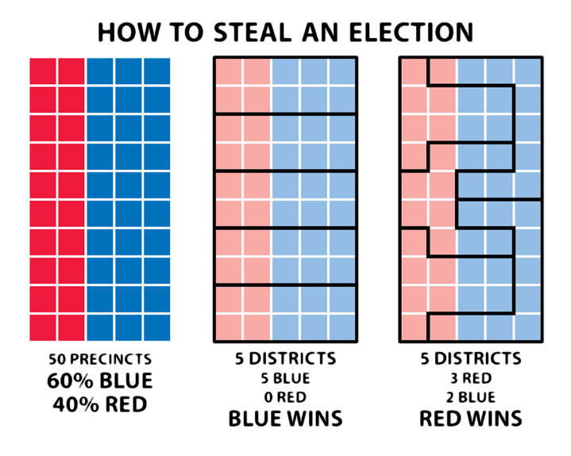

[Steven Nass, CC-BY 4.0](https://en.wikipedia.org/wiki/File:How_to_Steal_an_Election_-_Gerrymandering.svg)

Note:

-----

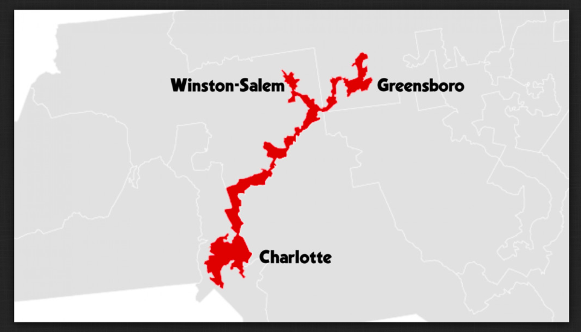

[From *How to Fight Fascism* by Mike Monteiro](https://speakerdeck.com/inuse/how-to-fight-fascism-mike-monteiro?slide=5)

-----

<!-- .slide: data-background-image="img/goodman.jpg" -->

### Technology is a branch of moral philosophy, not of science.

#### Paul Goodman

[Goodman, P. (1969). Can Technology Be Humane? *New York Review of Books*, Nov. 20, 1969](http://www.nybooks.com/articles/1969/11/20/can-technology-be-humane)

Note:
The late social critic Paul Goodman wrote about technology in the broadest sense of "knowledge applied to practical ends," in other words, design. Design solutions, designed services, designed products and tools. And creating those things, he argued, involved moral choices first and foremost. Because as we create new things, we are shaping the kinds of experiences, and therefore the kinds of choices and lives, that users of our designs will face.

-----

### Design is a branch of moral philosophy, not of science.

#### &nbsp;

-----

<!-- .slide: data-background-image="img/orphanides.jpg" -->

### System design reflects the designer's values and the cultural context.

#### Andreas Orphanides

[Architecture is politics: The power and the perils of systems design](https://docs.google.com/presentation/d/180dMBG26xMYB9gfIotoUyCBQfO3XfmHiJGQjvn58GwY/edit?pref=2&pli=1#slide=id.gf03c9bb35_0_143)

Note:
 In his insightful talk Architecture is Politics, UX Libs alum Andreas Orphanides notes that nearly all created and designed things embed within them the values and biases or their creators, whether we intend to or not. We're building systems that reflect our values, that inherently take stances about what is right and what is wrong.

-----
# What are our Values?

Note:
That's okay! You're saying. We want to help people! We are good designers! If that's the case, then what do our designs say about our values? What do our designs say is right, and what is wrong?

-----

Do we value our users' trust as much as the appearance of convenience? ([From @Nadaleen](https://twitter.com/Nadaleen/status/730116596728012800/photo/1))

Note:

-----

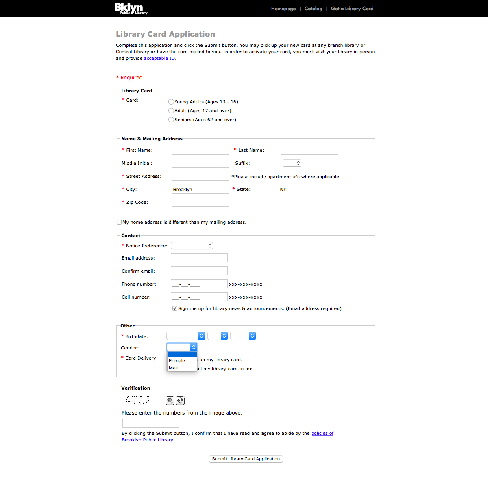

[Brooklyn Public Library's Online Library Card Application](https://bpl.brooklynpubliclibrary.org/patron/registration.aspx)

Note:
When we do create tools that allow our users better access to our services, are we encoding them with care for our users? Do our designs respect our users' right to be themselves? To have privacy? 

-----

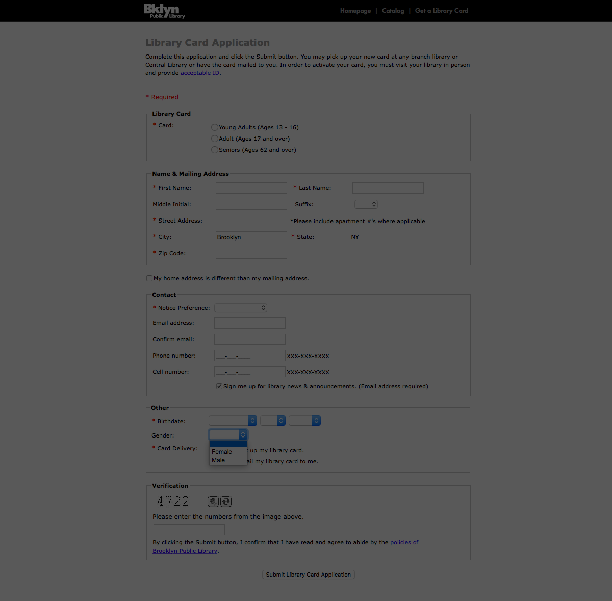

Do our political or religious beliefs shape the choices we offer users?

Note:
Do our political or religious beliefs, coupled with our fetish with data collection, affect our designs, tripping up our users?

-----

Do we value accuracy and equity more than the appearance of relevance?

Note:
When we build tools to help our users access resources and make sense of information, what values are being encoded into the designs? Do we value accuracy and equity more than the appearance of relevance?

-----

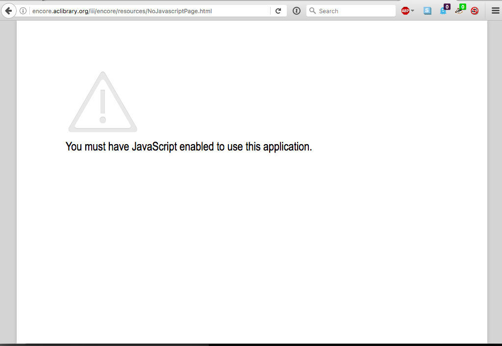

Do we value our users more than our desire to exploit new technologies?

Note:

-----

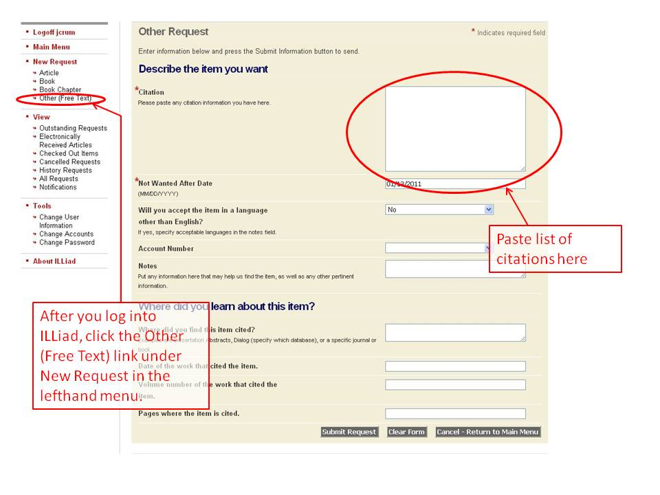

Do we respect our users more than our own workflows?

Note:
Pass.

-----

<!-- .slide: data-background-image="img/montero.jpg" -->

### This is how bad design makes it out into the world. Not due to malicious intent, but with no intent at all.

#### Mike Monteiro

[How Designers Destroyed the World](https://vimeo.com/68470326)

Note:

-----

<!-- .slide: data-background-image="img/hanson.png" -->

### Our expertise, our service ethic, and our values remain our greatest strengths. 

#### Cody Hanson

[Libraries are Software](http://codyhanson.com/writing/software.html)

Note:

-----

<!-- .slide: data-background-image="img/hanson.png"  -->

### But for us to have the impact we seek in the lives of our users, we must encode our services and our values in the software we provide.

#### Cody Hanson

[Libraries are Software](http://codyhanson.com/writing/software.html)

Note:

-----

-----

<!-- .slide: data-transition="fade-in" data-transition-speed="slow" -->

# Ethical Design

Note:

-----

[https://twitter.com/Cennydd/status/831431945930293248](https://twitter.com/Cennydd/status/831431945930293248)

Note:

-----

<!-- .slide: data-background-image="img/pohl.jpg" -->

### A good science fiction story should be able to predict not the automobile, but the traffic jam.

#### Frederic Pohl

&nbsp;

-----

<!-- .slide: data-background-image="img/montero.jpg" -->

### We need to fear the consequences of our work more than we love the cleverness of our ideas.

#### Mike Monteiro

[How Designers Destroyed the World](https://vimeo.com/68470326)

Note:

-----

<!-- .slide: data-background-image="img/papanek.jpg" -->

### [The designer’s] social and moral judgment must be brought into play long before [she] begins to design.

#### Victor Papanek

Papanek, V. (1971). *Design for the Real World: Human ecology and social change*. New York: Pantheon Books. p. 45.

Note:
Focus on people over data

-----

# Analytics

-----

<!-- .slide: data-background-image="img/ideo.jpg" -->

### The goal of design research isn’t to collect data; it’s to synthesize information and provide insight and guidance that leads to action.

#### IDEO

IDEO. (2016). *The Little Book of Design Research*, p.41

-----

<!-- .slide: data-background-image="img/galvan.jpg" -->

### For all the data [Library software vendors] have about our users, you’d think we’d have beautifully customized product[s].

#### Angela Galvan

[Architecture of Authority](https://asgalvan.com/2016/12/05/architecture-of-authority/)

-----

<!-- .slide: data-background-image="img/salo.jpg" -->

### The ALA Code of Ethics does not say: "We protect each library user's right to privacy and confidentiality ... except for Google Analytics."

#### Dorthea Salo  (Paraphrase by Eric Hellman)

[Ain't Nobody's Business If I Do (Read Serials)](https://www.youtube.com/watch?v=ZmRfyg3-YDc)

-----

<!-- .slide: data-background-image="img/chimero.jpg" -->

### Remove a person's humanity, and she is just a curiosity, a pinpoint on a map, a line in a list, an entry in a database. A person turns into a granular bit of information.

#### Frank Chimero

Chimero, F. (2011). The Space Between You and Me. *The Manual, 1*. p. 19

Note:

-----

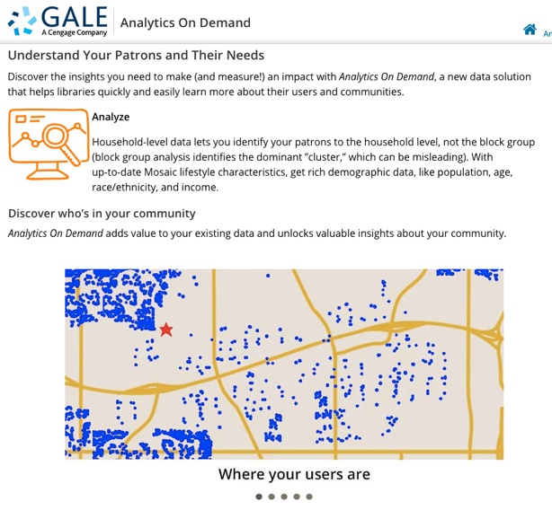

[Analytics on Demand](http://solutions.cengage.com/analytics/)

-----

<!-- .slide: data-background-image="img/gale2.png" -->

### Remove a person's humanity, and she is just a curiosity, a pinpoint on a map...

Chimero, F. (2011). The Space Between You and Me. *The Manual, 1*. p. 19

-----

# Personas

-----

<!-- .slide: data-background-image="img/hall.jpg" -->

### By designing for yourself or your team, you are potentially building discrimination right into your product.

#### Erica Hall

Hall, E. (2013). *Just Enough Research*. New York: A Book Apart. p. 79

-----

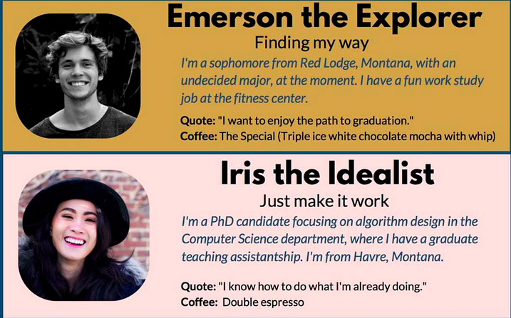

[Montana State Univesity Library: Design Research &gt; Personas](https://lib.montana.edu/design-research/personas)

Note:
Who are we designing for? A lot of us use personas in our work. Think of personas like trading cards, where each card represents some type of user, like "undergraduate students majoring in science" or "parents of small children." The persona will have a summary of typical goals for that group of users and a choice quote that helps you summarize user needs, as well as an identity created to help you understand the demographics you are designing for. 

These are some of the personas from Montana State University Library. They've done a really great job of documenting how they made these personas and how they use them.

-----

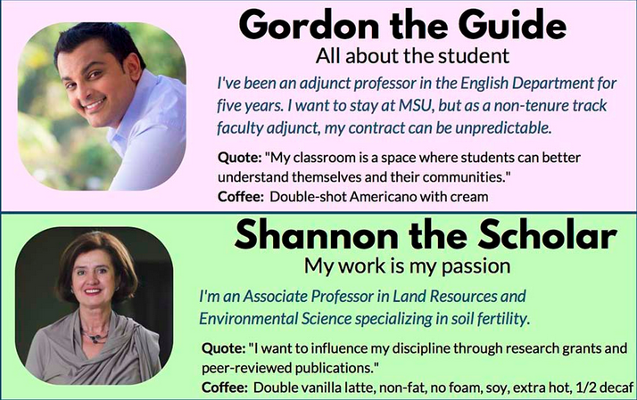

[Montana State University Library: Design Research &gt; Personas](https://lib.montana.edu/design-research/personas)

Note:
Here are a few more. Do you notice anything about these personas? Anything they have in common?

They're all smiling. The images that were chosen for these people are all happy images. Even the adjunct professor is smiling, even though he's making less than a barista at Starbucks!

Are our users are super happy to be in the library? Are they all having terrific lives, and nothing is going to affect the work they do in our spaces, with our services or tools?

-----

<!-- .slide: data-background-image="img/mcgrane.jpg" -->

### Who am I designing for? The expert automaton, programmed to complete each task flawlessly? Or the messy, error-prone, distracted human?

#### Karen McGrane

McGrane, K. (2011). Lesson. *The Manual (2)*. p.45

Note:

-----

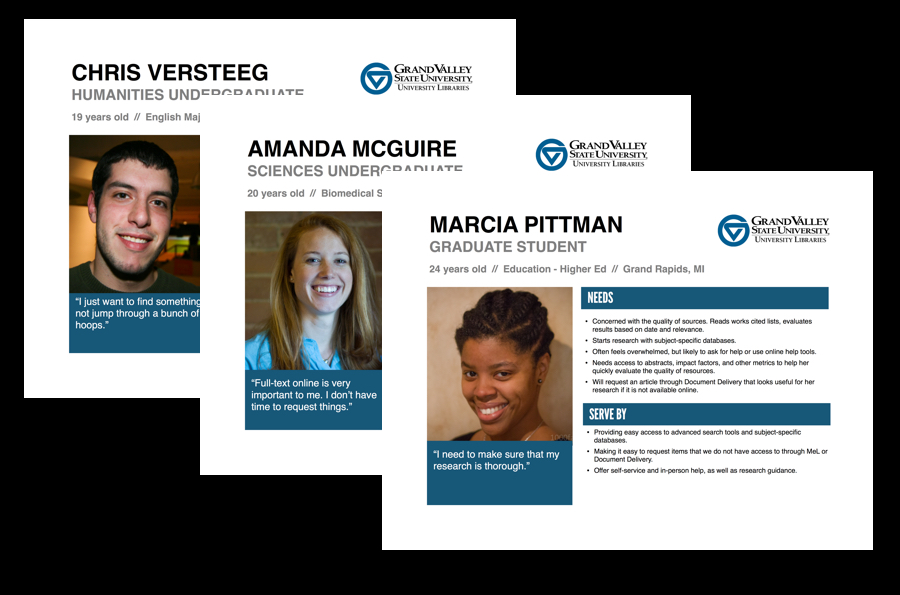

[Smiling GVSU Personas](http://libguides.gvsu.edu/styleguide/understandingusers)

Note:
Just so that you don't think I'm being too hard on Montana State, here are the smiling users on the personas I made for GVSU three years ago.

Look around at personas. And not just in libraries - everywhere. Personas are all smiling! Even when a user story isn't all happy (like the acknowledgment in Montana's adjunct persona that his contract is unpredictable) the user is smiling.

This can subtly affect how you think of the users you are designing for. 

-----

<!-- .slide: data-background-image="img/meyer.jpg" -->

### You don't get to decide whether or not users in crisis want to use your site.

#### Eric Meyer

[Designing for Crisis with Eric Meyer, *The Web Ahead*, January 9, 2015](http://thewebahead.net/91)

Note:

-----

# Algorithms

-----

<!-- .slide: data-background-image="img/ekstrom.jpg" -->

### Behind every algorithm is always a person, a person with a set of personal beliefs that no code can ever completely eradicate.

#### Andreas Ekström

[The Moral Bias Behind Your Search Results](https://www.ted.com/talks/andreas_ekstrom_the_moral_bias_behind_your_search_results)

-----

<!-- .slide: data-background-image="img/gillespie.jpg" -->

### Quick clicks and no follow-up searches [are] an approximation, not of relevance exactly, but of satisfaction.

#### Tarleton Gillespie

Gillespie, T. (2014). The Relevance of Algorithms. In T. Gillespie, P. Boczkowski & K. Foot (Eds.), *Media Technologies: Essays on Communication, Materiality, and Society*. Cambridge, MA: MIT Press. p. 175

-----

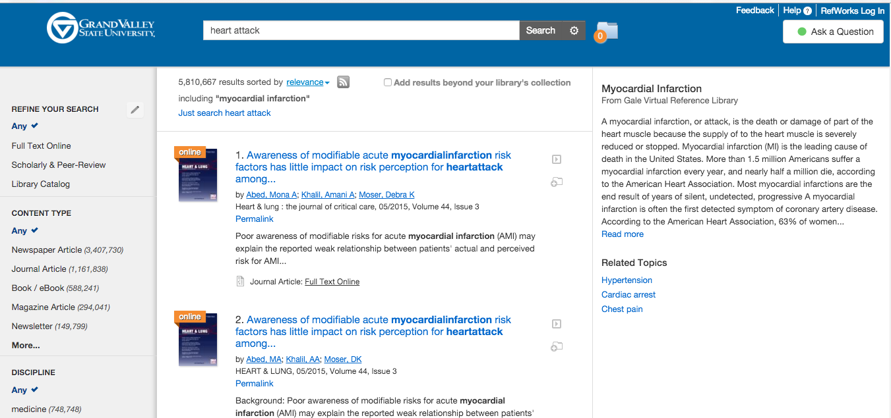

Topic Explorer Example

-----

Equating Virginity with Sexual Abstinence

-----

[From Damn You, Autosuggest](http://damnyouautosuggest.tumblr.com/post/114699603389/oh-go-to-hell)

-----

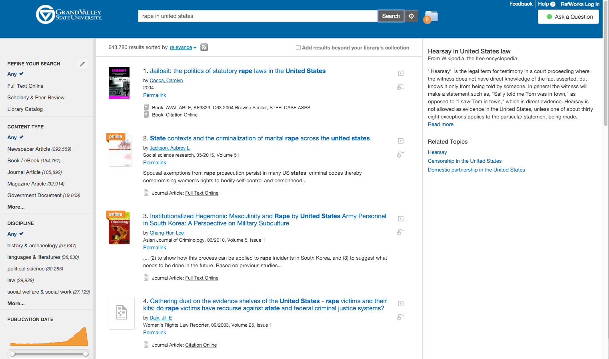

Implying that rape accusations are akin to Hearsay evidence?

-----

<!-- .slide: data-background-image="img/ananny.jpg" -->

### Reckless associations—made by humans or computers—can do very real harm especially when they appear in supposedly neutral environments.

#### Mike Ananny

[The Curious Connection Between Apps for Gay Men and Sex Offenders](https://www.theatlantic.com/technology/archive/2011/04/the-curious-connection-between-apps-for-gay-men-and-sex-offenders/237340/)

-----

<!-- .slide: data-background-image="img/zomorodi.jpg" -->

### You need to have diverse people to get diverse algorithms.

#### Manoush Zomorodi

[Privacy, Data Survivalism and a New Tech Ethics, *Note to Self*, Feb 21, 2017](https://www.wnyc.org/story/bonus-privacy-paradox/)

-----

<!-- .slide: data-background-image="img/soylent.jpg" data-transition="fade-in" data-transition-speed="slow" -->

# Your Library is People

-----

# ThankYou 

