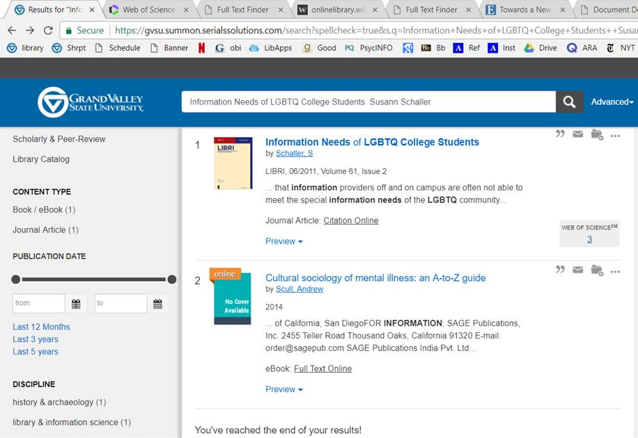
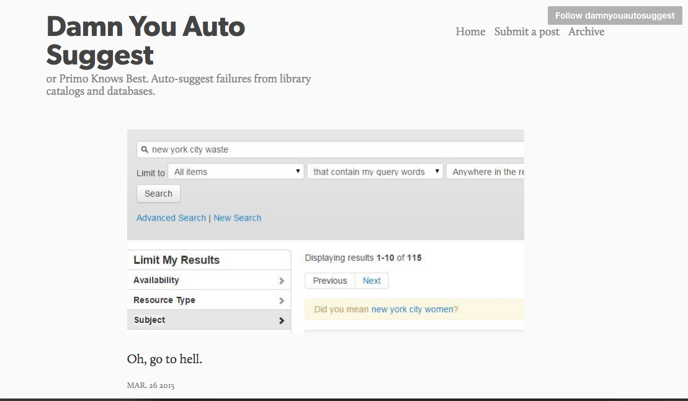
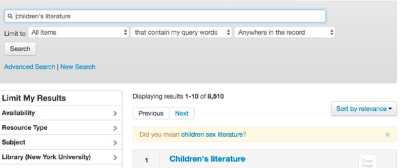

# Algorithms &amp; Models

Matthew Reidsma // Grand Valley State University

-----

### [gvsu.edu/library/bias](https://www.gvsu.edu/library/bias)

-----

<h1>Search Engines</h1> 

-----

<h1>Trust</h1>

-----

<video controls="controls">
    <source src="img/computersaysno.mp4" type="video/mp4" />
</video>

-----

<h1>What is an Algorithm?</h1>

-----

<!-- .slide: data-background-image="img/rudder_bg.jpg" -->

### Algorithms don't work well with things that aren't numbers.

#### Christian Rudder

Christian Rudder // Photo: [Washington Post](https://www.washingtonpost.com/posttv/national/on-leadership/christian-rudder-on-romance-and-algorithms--on-leadership/2014/10/31/6514f4dc-6104-11e4-827b-2d813561bdfd_video.html)

-----

<!-- .slide: data-background-image="img/turkle.jpg" -->

### If the computer needs rules in order to work, then areas of knowledge in which rules had previously been unimportant must formulate them or perish.

#### Sherry Turkle

Turkle, S. (1995). <em>Life on the Screen: Identity in the age of the Internet</em>. New York: Simon and Schuster. p. 107

-----

<!-- .slide: data-background-image="img/orphanides.jpg" -->

### System design reflects the designer's values and the cultural context.

#### Andreas Orphanides

[Architecture is politics: The power and the perils of systems design](https://docs.google.com/presentation/d/180dMBG26xMYB9gfIotoUyCBQfO3XfmHiJGQjvn58GwY/edit?pref=2&pli=1#slide=id.gf03c9bb35_0_143) // Photo: [NC State Libraries](http://www.lib.ncsu.edu/staff/akorphan)

-----

Google Search bias issues from 2016. 

-----

### Experiment

1. Open a Private Window
2. Go to Google Image Search
3. Search "Appalachian Photography"

-----

### Experiment

1. Open a Private Window
2. Go to Google Image Search
3. Search "Blue Ridge Photography"

-----

From [The Revolution Will Not Be Standardized](https://webcast.gigtv.com.au/Mediasite/Showcase/vala2018/Presentation/31066bb7c4bc483a8647dc496b4c68181d) by Scarlet Galvan.

-----

A known item search for a book on LGBT youth returns the item and a random book
on mental illness. What made the algorithm suggest this item?

-----

<!-- .slide: data-background-image="img/ananny.jpg" -->

### Reckless associations—made by humans or computers—can do very real harm especially when they appear in supposedly neutral environments.

#### Mike Ananny

[The Curious Connection Between Apps for Gay Men and Sex Offenders](https://www.theatlantic.com/technology/archive/2011/04/the-curious-connection-between-apps-for-gay-men-and-sex-offenders/237340/) // Photo: [mike.annany.com](http://mike.annany.com)

-----

Primo suggests that "Waste" is just "Women," misspelled. From [Damn You, Auto Suggest](http://damnyouautosuggest.tumblr.com)

-----

Primo suggesting Children's Sex Literature as a replacement for Children's Literature. From [@Nadaleen](https://twitter.com/Nadaleen/status/730116596728012800)

-----

Summon results for the Stress in the Workplace

-----

Summon results for the Mental Illness

-----

Summon results for the Birth of Feminism

-----

Implying that racism is really "scientific"?

-----

Illustrating a summary of sexual harrassment by showing an African American man in EDS.

-----

### Experiment

1. Visit Davenport University's Library
2. Search for **"The Birth of Tragedy"**
3. How many algorithmic results appear?
4. Examine all the results.

-----

### Experiment

1. Visit Davenport University's Library
2. Search for **"Women in film"**
3. Examine all the different algorithmic results

-----

### Experiment

1. Visit GVSU's Library Search
2. Search for **"women"**
3. Examine all the different algorithmic results

-----

### Experiment

1. Visit Georgia State's Library
2. Click on "Concept Map"
3. Select the "Map" view
3. Search for **"Adolph Hitler"**
4. Evaluate the results

-----

### Experiment

1. Visit Google
2. Type **"Did hitler"** and examine the suggestions
3. Select the first one
4. Examine the AI generated result at the top.

-----

# ThankYou 

