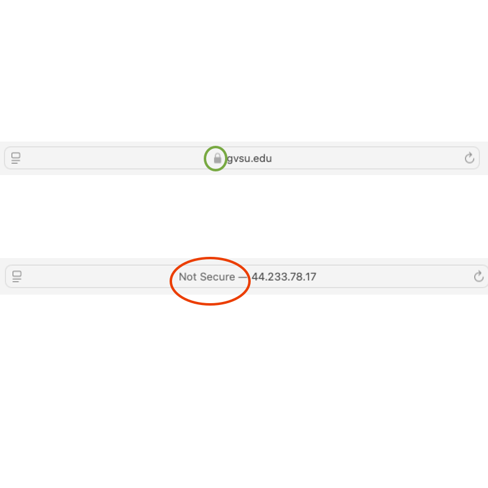
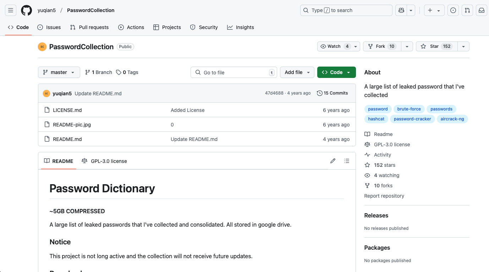
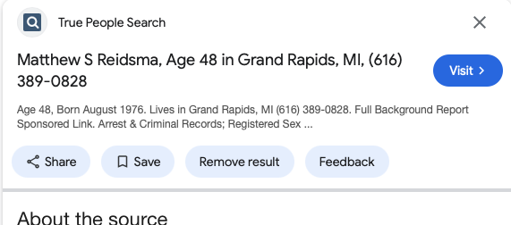
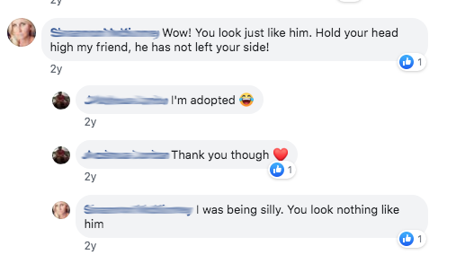
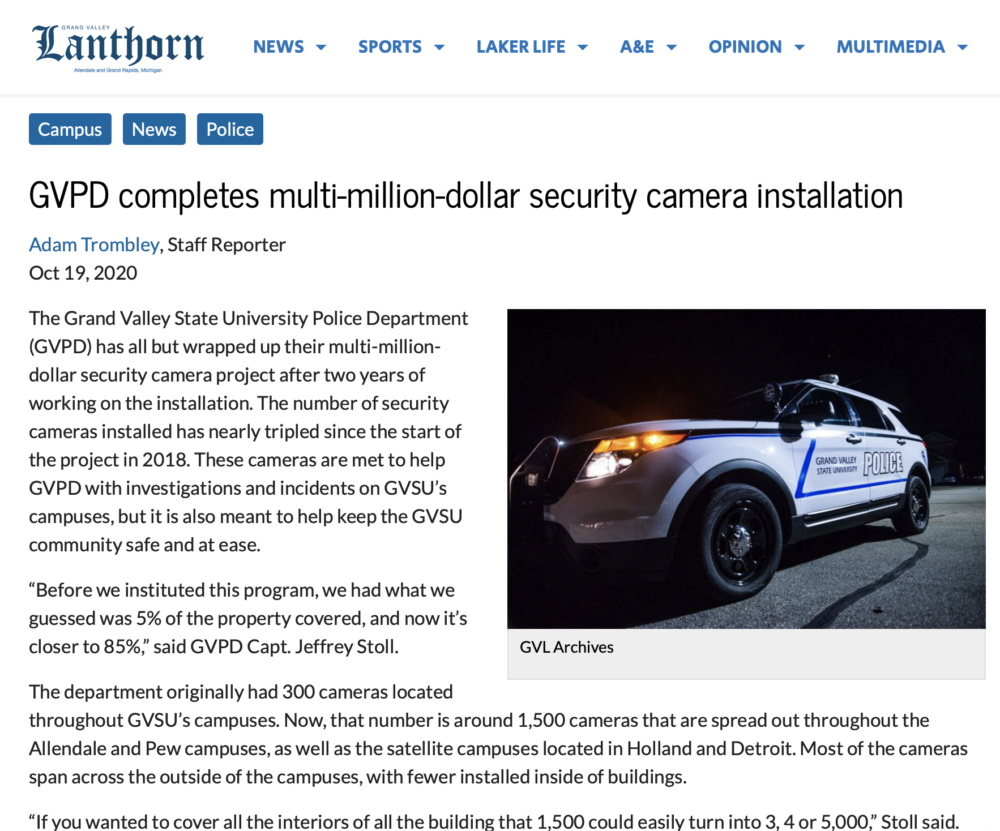
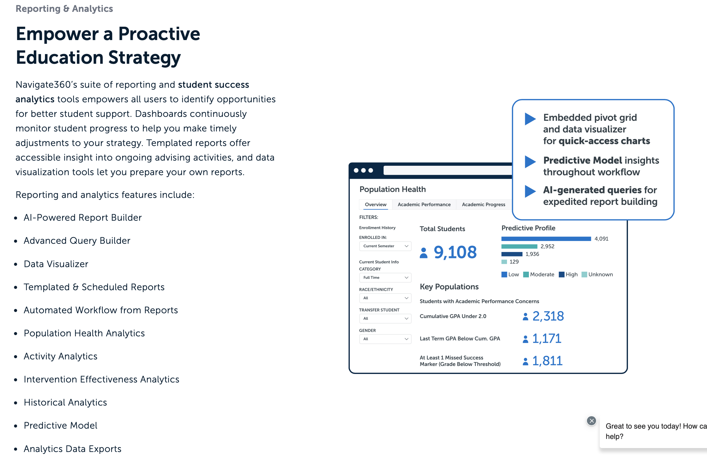
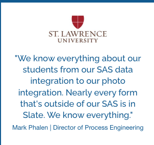
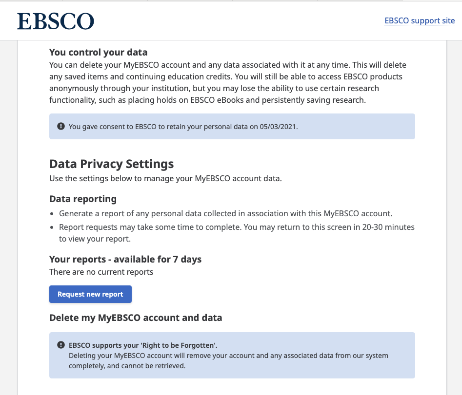

# Digital Privacy

Matthew Reidsma // Grand Valley State University

-----

### [mreidsma.github.io/slides/rc25](https://mreidsma.github.io/slides/rc25)

-----

<h1>Privacy vs. Secrecy</h1>

-----

<h1>Convenience vs. Privacy</h1>

-----

<h1>Cookies fingerprinting trackers</h1> 

-----

### Experiment

1. Open a Private Window
2. Go to Blacklight: [https://themarkup.org/blacklight](https://themarkup.org/blacklight)
3. Search a website you visit often

-----

### Resources

* [The Markup's Blacklight](https://themarkup.org/blacklight)
* [uBlock Origin](https://ublockorigin.com) - Privacy extension
* [Privacy Badger](https://privacybadger.org) - Privacy extension
* [Duck Duck Go](https://duckduckgo.com)
* Don't Use Chrome. 🤷‍♂️

-----

<h1>Secure Browsing</h1>

-----

<h1>SSL &amp; TLS</h1>

<h2>HTTPS</h2>

-----

<h1>Fun Demonstration Time</h1>

-----

## Wireshark.app

<iframe src="https://gvsu.hosted.panopto.com/Panopto/Pages/Embed.aspx?id=7698f861-52c9-4efe-9bf4-b2a600cbca6f&autoplay=false&offerviewer=false&showtitle=false&showbrand=false&captions=false&interactivity=all" height="607" width="1080" style="border: 1px solid #464646;" allowfullscreen allow="autoplay" aria-label="Panopto Embedded Video Player" aria-description="wireshark" ></iframe>

[https://gvsu.hosted.panopto.com/Panopto/Pages/Viewer.aspx?id=7698f861-52c9-4efe-9bf4-b2a600cbca6f](https://gvsu.hosted.panopto.com/Panopto/Pages/Viewer.aspx?id=7698f861-52c9-4efe-9bf4-b2a600cbca6f)

-----

-----

<h1>PSA:</h1>

### "Private" windows are not private.

-----

### Resources

* [HTTPS Everywhere](https://www.eff.org/https-everywhere)
* [ProtonMail](https://proton.me/) - Free encrypted webmail
* Don't Use Chrome. 🤷‍♂️

-----

<h1>Password Leaks</h1> 

-----

[Combination of Many Breaches](https://github.com/yuqian5/PasswordCollection?tab=readme-ov-file)

-----

### Experiment

1. Open a Private Window
2. Go to Have I Been Pwned: [https://haveibeenpwned.com](https://haveibeenpwned.com)
3. Search Your Email

-----

### Resources

* [ProtonPass](https://proton.me/pass) - Free Secure Password Manager
* Use Unique Passwords, [try password phrases](https://diceware.dmuth.org)
* Enable Multi-factor Authentication Where You Can

-----

<h1>Personally-identifying information (PII)</h1>

-----

### Experiment

1. Open a Private Window
2. Go to Google Search
3. Search Your Name + "age"

-----

Google's Remove Result image.

-----

### Resources

* [Removing PII from Google Results](https://support.google.com/websearch/answer/12719076?hl=en)
* [Freeze Credit Accounts](https://www.usa.gov/credit-freeze)
* [Lock Credit or Debit Cards When Not In Use](https://www.nerdwallet.com/article/credit-cards/card-lock-how-to-use-it-strategically)
* Social Media Privacy Settings!

-----

Screenshot from Facebook, 2019.

-----

<h1>It Can't Happen Here</h1>

-----

### Experiment

1. Open a Private Window
2. Go to Blacklight: [https://themarkup.org/blacklight](https://themarkup.org/blacklight)
3. Search "gvsu.edu"

-----

[https://lanthorn.com/77969/news/gvpd-completes-multi-million-dollar-security-camera-installation/](https://lanthorn.com/77969/news/gvpd-completes-multi-million-dollar-security-camera-installation/) - [GVSU Security Camera Policy](https://www.gvsu.edu/policies/policy.htm?policyId=5C867BBB-F2E4-327F-BF580D5FFC08EE50)

-----

<h1>Learning  Analytics</h1>

-----

[EAB Navigate Marketing Materials](https://eab.com/solutions/navigate360/)

-----

### [slate.org](https://slate.org)

-----

[Slate Corporate](https://eab.com/solutions/navigate360/)

-----

<h3><a href="https://www.gvsu.edu/library/privacy" target="_blank">https://www.gvsu.edu/library/privacy</a></h3>

-----

-----

### Access EBSCO's Privacy Info

1. [Log into Library Account](https://www.gvsu.edu/library/renew)
2. Select "My EBSCO" > Manage Your Account
3. Select "Personal Data Retention and Usage"

-----

### Resources

* [The Privacy paradox](https://www.wnycstudios.org/podcasts/notetoself/episodes/privacy-paradox-launch)
* [Surveillance Self-Defense](https://www.eff.org/pages/surveillance-self-defense)
* [The Electronic Frontier Foundation Privacy resources for students](https://ssd.eff.org/module/privacy-students )
* [The Library Freedom Project](https://libraryfreedom.org/resources/)

-----

# ThankYou 

