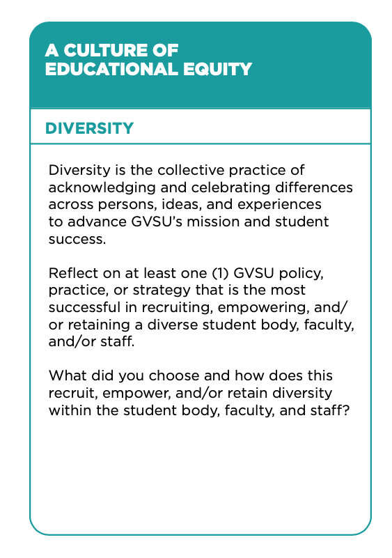

# Reach Higher

Matthew Reidsma // Grand Valley State University

-----

[https://www.gvsu.edu/president/reach-higher-collaborative-leadership-network-18.htm](https://www.gvsu.edu/president/reach-higher-collaborative-leadership-network-18.htm)

-----

<h1>3 Commitments</h1> 

-----

[https://www.gvsu.edu/reachhigher/commitments-33.htm](https://www.gvsu.edu/reachhigher/commitments-33.htm)

-----

[https://www.gvsu.edu/reachhigher/commitments-33.htm](https://www.gvsu.edu/reachhigher/commitments-33.htm)

-----

[https://www.gvsu.edu/reachhigher/commitments-33.htm](https://www.gvsu.edu/reachhigher/commitments-33.htm)

-----

[https://www.gvsu.edu/s/336](https://www.gvsu.edu/s/336)

-----

<h1>Let's Talk</h1>

-----

<!-- .slide: data-background-image="img/orphanides.jpg" -->

### System design reflects the designer's values and the cultural context.

#### Andreas Orphanides

[Architecture is politics: The power and the perils of systems design](https://docs.google.com/presentation/d/180dMBG26xMYB9gfIotoUyCBQfO3XfmHiJGQjvn58GwY/edit?pref=2&pli=1#slide=id.gf03c9bb35_0_143) // Photo: [NC State Libraries](http://www.lib.ncsu.edu/staff/akorphan)

-----

[https://padlet.com/47pfjjjr86/reach-higher-empowered-educational-experience-1oj6remdt6npzecy](https://padlet.com/47pfjjjr86/reach-higher-empowered-educational-experience-1oj6remdt6npzecy)

-----

From [The Revolution Will Not Be Standardized](https://webcast.gigtv.com.au/Mediasite/Showcase/vala2018/Presentation/31066bb7c4bc483a8647dc496b4c68181d) by Scarlet Galvan.

-----

[https://padlet.com/47pfjjjr86/reach-higher-lifetime-of-learning-xgtr0opnm8d2kqmd](https://padlet.com/47pfjjjr86/reach-higher-lifetime-of-learning-xgtr0opnm8d2kqmd)

-----

[https://padlet.com/47pfjjjr86/reach-higher-culture-of-educational-equity-zap1li3fospbrua2](https://padlet.com/47pfjjjr86/reach-higher-culture-of-educational-equity-zap1li3fospbrua2)

-----

<h1>Next Steps</h1>

-----

# ThankYou 

