# Algorithms &amp; Models

Matthew Reidsma // Grand Valley State University

-----

<h1>Algorithm</h1>

-----

<h1>Big Data</h1>

-----

Christian Rudder // Photo: [Washington Post](https://www.washingtonpost.com/posttv/national/on-leadership/christian-rudder-on-romance-and-algorithms--on-leadership/2014/10/31/6514f4dc-6104-11e4-827b-2d813561bdfd_video.html)

-----

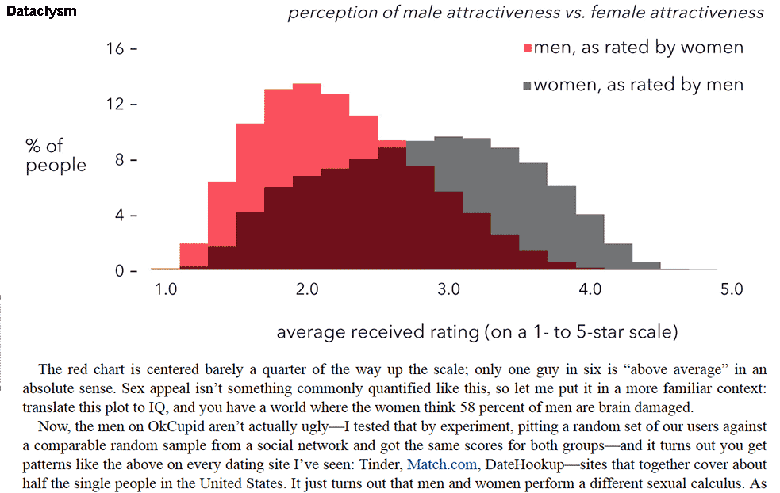

Rudder, C. (2014). *Dataclysm: Who we are when we think no one's looking*. New York: Crown Publishers. p. 13

-----

<!-- .slide: data-background-image="img/rudder_bg.jpg" -->

### Algorithms don't work well with things that aren't numbers.

#### Christian Rudder

Christian Rudder // Photo: [Washington Post](https://www.washingtonpost.com/posttv/national/on-leadership/christian-rudder-on-romance-and-algorithms--on-leadership/2014/10/31/6514f4dc-6104-11e4-827b-2d813561bdfd_video.html)

-----

<!-- .slide: data-background-image="img/turkle.jpg" -->

### If the computer needs rules in order to work, then areas of knowledge in which rules had previously been unimportant must formulate them or perish.

#### Sherry Turkle

Turkle, S. (1995). <em>Life on the Screen: Identity in the age of the Internet</em>. New York: Simon and Schuster. p. 107

-----

Rudder, C. (2014). *Dataclysm: Who we are when we think no one's looking*. New York: Crown Publishers. p. 13

-----

<!-- .slide: data-background-image="img/oneil.jpg" -->

### But the point is not whether some people benefit. It's that so many suffer.

#### Cathy O'Neil

O'Neil, C. (2016). *Weapons of Math Destruction: How Big Data Increases Inequality and Threatens Democracy*. New York: Crown. p. 31.

-----

<video controls="controls">
    <source src="img/computersaysno.mp4" type="video/mp4" />
</video>

-----

[Propublica: Machine Bias](https://www.propublica.org/article/machine-bias-risk-assessments-in-criminal-sentencing)

-----

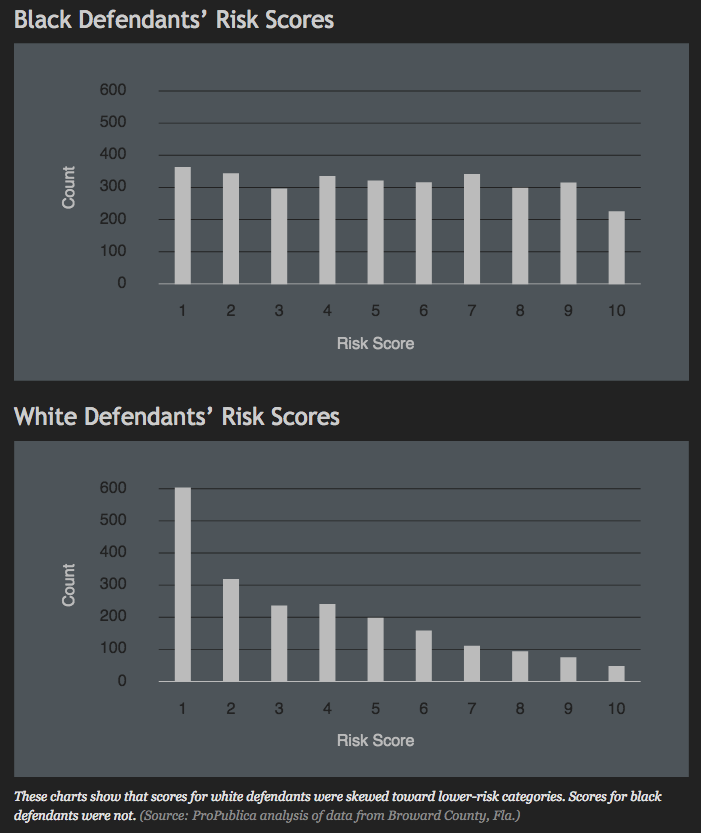

[Propublica: Machine Bias](https://www.propublica.org/article/machine-bias-risk-assessments-in-criminal-sentencing)

-----

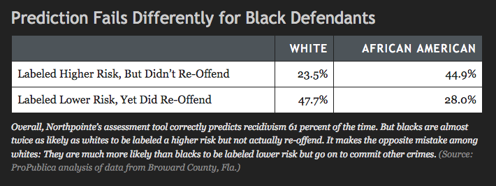

[Propublica: Machine Bias](https://www.propublica.org/article/machine-bias-risk-assessments-in-criminal-sentencing)

-----

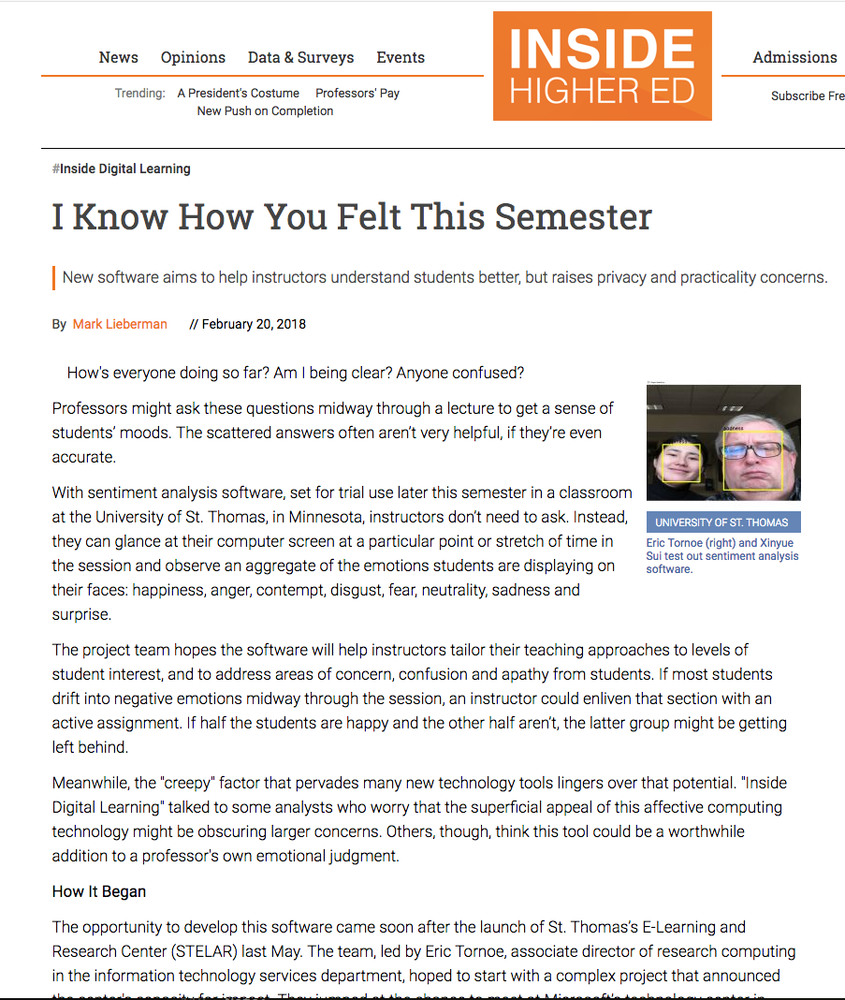

[I Know How You Felt This Semester](https://www.insidehighered.com/digital-learning/article/2018/02/20/sentiment-analysis-allows-instructors-shape-course-content)

-----

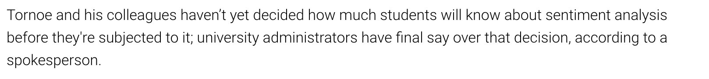

[I Know How You Felt This Semester](https://www.insidehighered.com/digital-learning/article/2018/02/20/sentiment-analysis-allows-instructors-shape-course-content)

-----

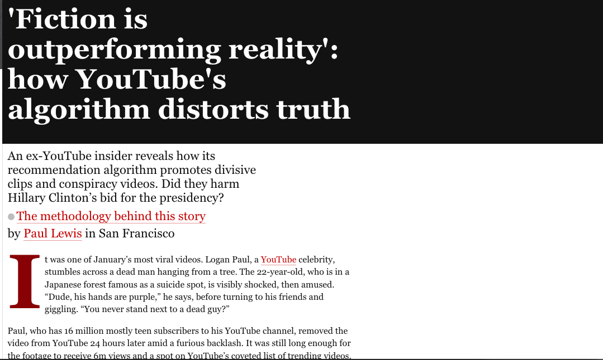

['Fiction is outperforming reality': how YouTube's algorithm distorts truth](https://www.theguardian.com/technology/2018/feb/02/how-youtubes-algorithm-distorts-truth)

-----

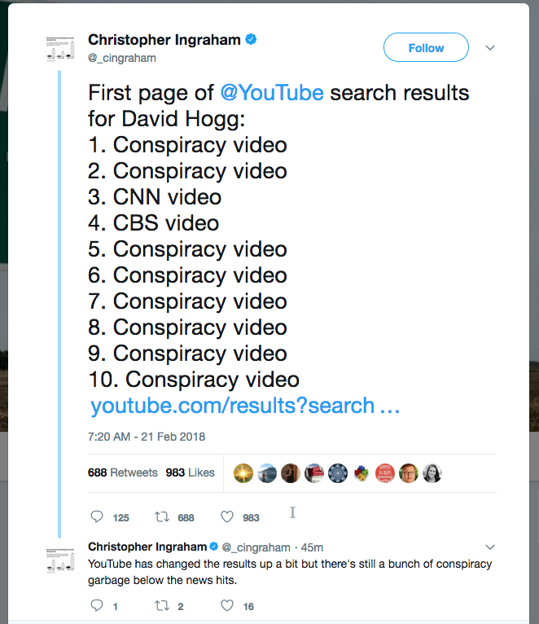

[Christopher Ingraham on Twitter](https://twitter.com/_cingraham/status/966331897457426434)

-----

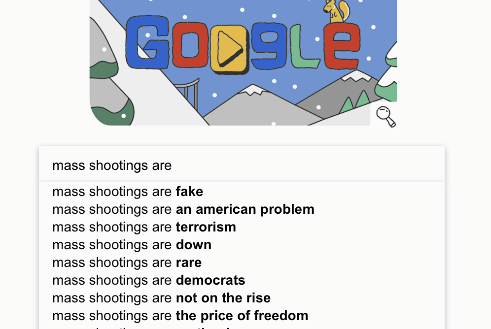

[#NotOKGoogle Search Suggestions: 2018 Edition](https://medium.com/@d1gi/notokgoogle-search-suggestions-2018-edition-ba09eaf49fc2)

-----

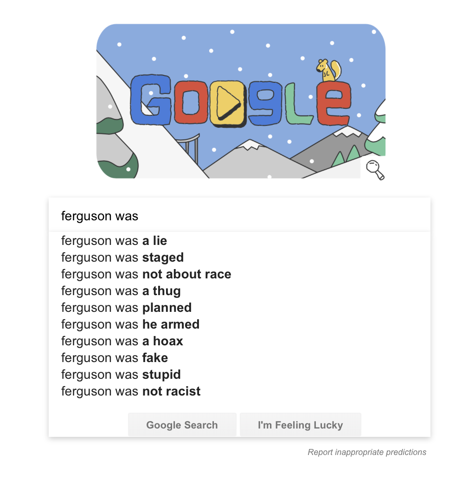

[#NotOKGoogle Search Suggestions: 2018 Edition](https://medium.com/@d1gi/notokgoogle-search-suggestions-2018-edition-ba09eaf49fc2)

-----

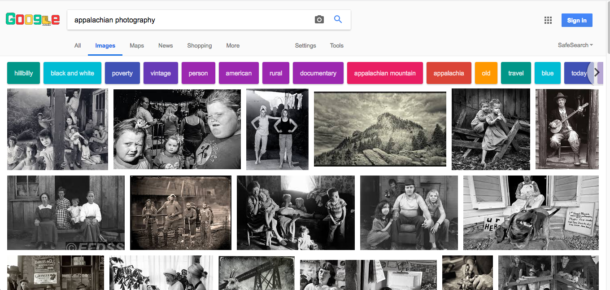

[Passive, poor and white? What people keep getting wrong about Appalachia](https://www.theguardian.com/us-news/2018/feb/06/what-youre-getting-wrong-about-appalachia)

-----

<iframe width="560" height="315" src="https://www.youtube.com/embed/iZ17h4e7k_s?rel=0" frameborder="0" allow="autoplay; encrypted-media" allowfullscreen></iframe>

[Digital Polarlization on Pinterest](https://www.youtube.com/watch?v=iZ17h4e7k_s)

-----

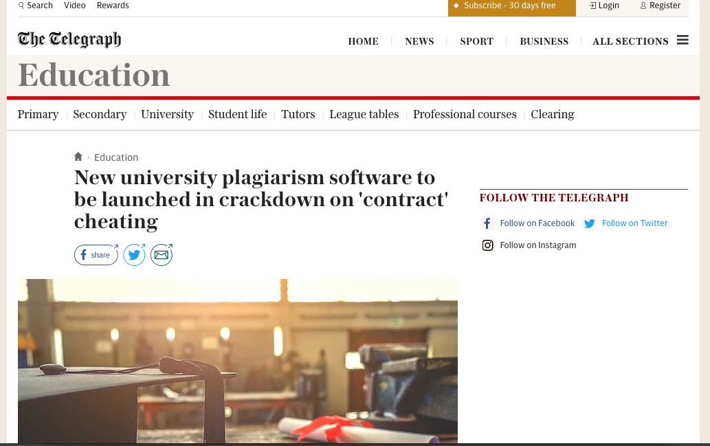

[New university plagiarism software to be launched in crackdown on 'contract' cheating ](http://www.telegraph.co.uk/education/2018/02/01/new-university-plagiarism-software-launched-crackdown-contract/)

-----

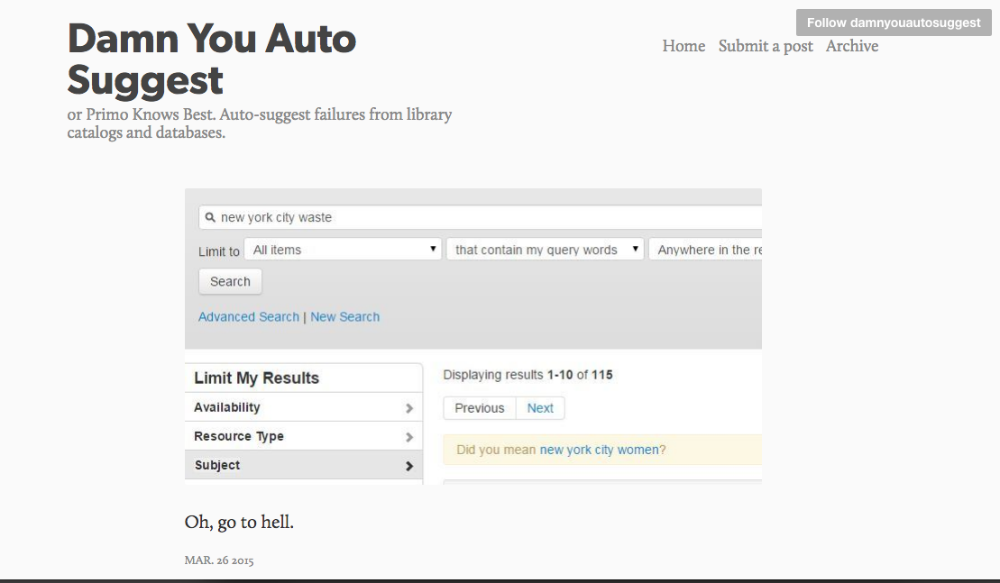

Primo suggests that "Waste" is just "Women," misspelled. From [Damn You, Auto Suggest](http://damnyouautosuggest.tumblr.com)

-----

Primo suggesting Children's Sex Literature as a replacement for Children's Literature. From [@Nadaleen](https://twitter.com/Nadaleen/status/730116596728012800)

-----

Summon results for the Stress in the Workplace

-----

Summon results for the Mental Illness

-----

Summon results for Women in Film

-----

Summon results for the Birth of Feminism

-----

A known item search for a book on LGBT youth returns the item and a random book
on mental illness. What made the algorithm suggest this item?

-----

<!-- .slide: data-background-image="img/ananny.jpg" -->

### Reckless associations—made by humans or computers—can do very real harm especially when they appear in supposedly neutral environments.

#### Mike Ananny

[The Curious Connection Between Apps for Gay Men and Sex Offenders](https://www.theatlantic.com/technology/archive/2011/04/the-curious-connection-between-apps-for-gay-men-and-sex-offenders/237340/) // Photo: [mike.annany.com](http://mike.annany.com)

-----

# ThankYou 

